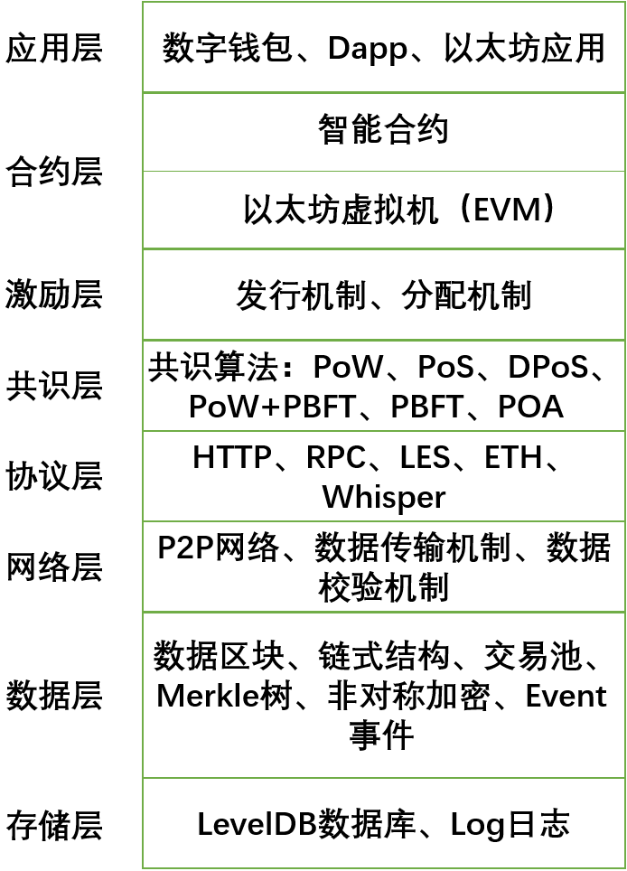

# 7.3.2 以太坊系统

&emsp;&emsp;以太坊（Ethereum）是将比特币中的一些技术和概念运用于计算领域的一项创新。比特币被认为是一个系统，该系统维护了一个安全地记录了所有比特币账单的共享的账本。以太坊利用了很多跟比特币类似的机制（比如区块链技术和P2P网络），来维护一个共享的计算平台，这个平台可以灵活且安全地运行用户想要的任何程序。

&emsp;&emsp;以太坊的目的是创建一个构建去中心化应用程序的替代协议，提供一套不同的权衡方案，我们认为这将对大多数去中心化应用程序非常有用。以太坊通过构建最终的抽象基础层来做到这一点：具有内置图灵完备编程语言的区块链，允许任何人编写智能合约和去中心化应用程序，他们可以在其中创建自己的所有权，交易格式和状态转换功能。可以用两行代码来编写Namecoin的基本版本，也可以在不到二十行的代码中内置其他协议（例如货币和信誉系统），也可以在平台之上构建智能合约，即包含价值并只有在满足特定条件时才能解锁的密码“盒子”，其功能远比比特币脚本提供的功能强大，这是因为图灵完备性的附加功能，价值意识，区块链意识和状态的支撑。以下为以太坊系统架构图：

&emsp;&emsp;如图所示，以太坊系统架构大体上分为8层，由底层到应用层依次为存储层、数据层、网络层、协议层、共识层、激励层、合约层、应用层。每个层级的主要功能为：

1. 存储层：用于存储以太坊系统运行过程中产生的区块链元数据和系统日志。区块链元数据采用LevelDB数据库存储，系统日志由文件系统存储；
2. 数据层：数据层是区块链的核心，主要处理以太坊交易中的各类数据，完成数据的编码、解码，将数据打包成区块，将区块拼接成链式结构，处理区块数据签名并添加时间戳印记，将交易数据构建成Merkle树，并计算Merkle树根节点的hash值等；
3. 网络层：主要实现网络节点的连接和通讯，又称点对点技术（P2P）；
4. 协议层：以太坊提供的系统各模块相互调用的协议支持，主要有 HTTP、RPC协议、LES、ETH 协议、Whipser协议等。以太坊基于HTTP Client实现了对HTTP的支持，实现了GET、POST等HTTP方法。外部程序通过JSON RPC调用以太坊的API时需通过RPC(远程过程调用)协议。Whisper协议用于DApp间通信。LES的全称是轻量级以太坊子协议(Light Ethereum Sub-protocol)，允许以太坊节点同步获取区块时仅下载区块的头部，在需要时再获取区块的其他部分；
5. 共识层：主要实现全网所有节点对交易和数据达成一致，防范拜占庭攻击、女巫攻击、51%攻击等共识攻击，其算法称为共识机制。共识机制是区块链的核心技术，它决定了有谁来出块，出块权选择方案将影响整个系统的安全与稳定。常用的共识机制有POW（Proof of work）工作量证明、POS（Proof of stake）权益证明等；
6. 激励层：激励层主要是为了实现代币的发行和分配，采用经济利益来规范整个系统正常循环发展；
7. 合约层：智能合约是运行在以太坊虚拟机上代码的统称。智能合约的开发一般采用Solidity编程语言，编译成功后部署到 EVM 上运行执行；
8. 应用层：基于以太坊系统开发应用产品，根据不同场景开发相应的应用，是开发者主要的工作区。

&emsp;&emsp;总结：从以太坊源码分析来看，以太坊系统架构可以分成8个层级，每个层级直接是有依赖关系的，最终形成一套完整的系统。

## 7.3.2.1 以太坊原理
以太坊协议的设计遵循以下几点原则：
1. 三明治复杂模型：以太坊的底层协议应尽可能的简单，接口设计应易于理解，那些不可避免的复杂部分应放入中间层。中间层不是核心共识的一部分，且对最终用户不可见，它包含：高级语言编译器、参数序列化和反序列化脚本、存储数据结构模型、leveldb存储接口以及线路协议等；
2. 自由：不应限制用户使用以太坊协议，也不应试图优先支持或不支持某些以太坊合约或交易。这一点与“网络中立”概念背后的指导原则相似。比特币交易协议就没有遵循这一原则。在比特币交易协议中，并不鼓励为了“去除标签”而使用区块链（如：数据存储，元协议）。某些情况下，对准协议进行明显修改会引起不法分子以未经授权方式使用区块链来攻击应用。因此，在以太坊，我们强烈建议设置交易费用，且用户使用区块链的步骤越多，交易费用也就越多（类似庇古税）；
3. 泛化：以太坊协议的特性和操作码应最大限度地体现低层次的概念（就像基本粒子一样），以便它们可以随意组合。因此，通过剥离那些不需要的功能，使低层次的概念更加高效。遵循这一原则的例子是：我们选择LOG操作码作为向dapps提供信息的方式，而不是像之前那样记录下所有交易和消息信息。在早先，“消息(message)”的概念完完全全是多种概念的集合，它包含“函数调用(function call)”和“外在观察者感兴趣的事情(event interesting to outside watchers)”，而两者是完全可以分离开来的；
4. 没有特点就是最大的特性点：为了遵循泛化原则，我们拒绝将那些高级用例内嵌为协议的一部分，哪怕是经常使用的用例，也绝不这么做。如果人们真的想实现这些用例，可以在合约内创建子协议（如，基于以太坊的子货币，比特币/莱特币/狗币的侧链等）。比如，在以太坊中就缺少类似比特币中的“时间锁定”功能。但是，通过以下协议可以模拟出这个功能：用户发送签名数据包到特定的合约中处理，如果数据包在特定合约中有效，则执行相应的函数；
5. 没有风险规避机制：如果风险的增加带来了可观的好处，我们愿意承担更高的风险（例如，广义状态转换，区块时间提升50倍，共识效率）。

&emsp;&emsp;这些原则指导着以太坊的发展，但它们并不是绝对的；某些情况下，为了减少开发时间或者不希望一次作出过多改变，也会使我们推迟作出某些修改，把它留到将来的版本中去修改。