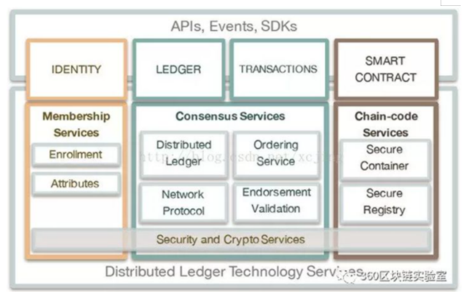

&emsp;&emsp;众所周知，区块链分为公有链、联盟链、私有链，同时本书也介绍了比特币及以太坊等区块链应用。虽然公有链完全去中心化特性是大众所期待的，但公链环境效率低下，不适合在企业级应用下进行应用，当前各个企业都在寻求利用区块链平台解决一些行业痛点，要支持各种行业应用，对于企业级应用，应考虑一下需求：

1. 参与者必须是已认证且可识别
2. 网络需要授权
3. 高性能的交易吞吐量
4. 消息确认低延迟
5. 与商业有关的交易及数据的隐私性

综上，联盟链更适合企业级应用。因此，Hyperledger作企业之间的联盟链基础平台受到了各大企业的青睐。

### 7.3.3.1Hyperledger Fabric简介
&emsp;&emsp;Hyperledger Fabric是一个开源的企业级许可分布式账本技术（Distributed Ledger Technology，DLT）平台，专为在企业级应用而设计，与其他流行的分布式账本或区块链平台相比，它有一些主要的区别：

1. Hyperledger 是由Linux 基金会建立的，其开放式治理的模式下培育开源项目的历史悠久且非常成功，发展了强大的可持续社区和繁荣的生态系统。Hyperledger由多元化的技术指导委员会进行管理，Hyperledger Fabric项目由多个组织的不同的维护人员管理；
2. Fabric提供了诸如银行、金融、医疗保险等广泛的行业用例，具有高度模块化和可配置的架构。
Fabric支持用Java、Go和Nodejs等通用编程语言编写智能合约的区块链平台，不受限特定领域的语言，大多数企业都具备这些条件，降低企业开发成本；
3. Fabric平台需要许可，通过许可参与平台活动，与公有链平台不同，平台网络中的参与者彼此相识且不匿名，尽管参与者可能不是彼此完全信任，但由于网络是在基于参与者之间信任的治理模型下运行，就如法律协议或框架来处理纠纷；
4. Fabric支持可插拔的共识协议，使得平台能够更有效地进行定制，以适应特定的业务场景和信任模型。例如，当部署在单个企业内或由可信任的权威机构管理时，完全拜占庭容错的共识可能是不必要的，并且大大降低了性能和吞吐量。在这种的情况下，崩溃容错（Crash Fault-Tolerant，CFT）共识协议可能应付，而在去中心化的场景中，可能需要更传统的拜占庭容错（Byzantine Fault Tolerant，BFT）共识协议。

#### 逻辑架构图
&emsp;&emsp;Fabric架构分为上下两层，分别为应用层和区块链层，如图7-1：

1. 顶层是应用层，是应用程序与Fabric进行交互的媒介，包括身份管理，账本处理，交易处理和智能合约；
2. 底层是核心的区块链实现，包括成员管理，共识服务，分布式账本，排序服务，P2P网络，链码服务，安全和加密服务。
   

&emsp;&emsp;IDENTITY（身份管理）：Fabric的设计目标是联盟链，这个目标决定了Fabric在用户管理上和Bitcoin等公链有很大的不同。需要充分的考虑到商业应用对安全、隐私、监管、审计、性能等方面的需求，成员必须被许可才能加入网络。此模块为整个区块链网络提供身份管理、隐私、保密和可审计的服务。

&emsp;&emsp;Ledger（账本管理）：应用程序对于账本的管理主要是两种类型，一种是数据的读取，另一种是数据写入。只有获得授权的用户才可以查询账本数据，并且有多种可以使用的查询方式，包括使用区块号查询区块，使用区块hash查询区块，使用交易ID查询交易，还可以根据Channel的名字查询区块链信息

&emsp;&emsp;Transactions（交易管理）：应用程序对于数据的写入，只能通过发起一个交易的方式来完成。Fabric SDK提供了相应的Interface，应用程序调用SDK接口，通过交易管理提交交易提案（Transaction Proposal），应用程序收集到经过背书（Endorsement）之后的交易之后，通过广播发送给排序服务（Orderer）节点，经过排序之后，生成区块。

&emsp;&emsp;Smart Contract（智能合约）：Fabric的智能合约称为Chaincode（链码），它处理网络成员所同意的业务逻辑。Fabric链码和底层账本是分开的，升级链码时并不需要迁移账本数据到新链码当中，实现逻辑与数据的分离。
应用程序提交到区块链的Transaction，只能通过Chaincode执行，才能实现区块链的业务逻辑。只有Chaincode才能更新账本数据，其他模块都不能直接修改账本数据。
Chaincode可采用Go、Java、Node.js等语言编写。Chaincode被编译成一个独立的应用程序，然后这个Chaincode应用程序可以部署到Docker容器中运行。

&emsp;&emsp;Membership Service（成员管理服务）：MSP（Membership Service Provider）对成员管理进行了抽象，对应用层的身份管理提供服务。每个MSP都会建立根信任证书体系，验证用户提交请求的签名。通过公钥基础设施PKI和去中心化共识机制使得非许可的区块链变成许可制的区块链。用户获取证书需要通过CA系统，可以使用第三方的CA认证系统，也可以使用Fabric-CA服务。CA系统负责用户注册，并管理用户身份证书，比如新增或者撤销。注册的证书又分为三种类型，注册证书（ECert）用于用户身份，交易证书（TCert）用于交易签名，TLS证书（TLS Cert）用于TLS数据传输。

&emsp;&emsp;Consensus Service（共识服务）：共识服务是区块链的核心组件，需要确保区块里面每一个交易数据的有效性和有序性，网络上不同节点之间数据的一致性。共识机制由如下几个阶段组成：客户端向背书节点提交交易提案进行背书签名，背书节点把经过背书签名后的交易发送回客户端，客户端收集到足够数量的背书交易后把这些交易广播给排序服务节点，排序服务对交易进行排序并且产生区块（Block），之后把这些区块广播给记账节点，记账节点在验证所有的交易和背书信息都有效之后把区块（Block）写入账本。

&emsp;&emsp;Chaincode Service（链码服务）：应用层的智能合约执行，需要依赖底层链码服务的实现。链码服务为智能合约提供安全的执行环境，确保执行过程的安全和用户数据的隔离，保证用户数据的私密性。Fabric采用Docker容器来管理和执行链码，提供安全的沙箱环境和镜像文件仓库。这有利于支持多种语言编写的链码，扩展性很好。

&emsp;&emsp;Security and Crypto Service（安全和加密服务）：安全问题是区块链的核心问题之一，对于企业级的联盟链更是重中之重。Fabric定义了一套BCCSP（Blockchain Cryptographic Service Provider）接口，可以根据这个接口来替换安全模块。在实现模块中，包含了密钥生成，Hash计算，签名以及验证签名，加密解密等等。

