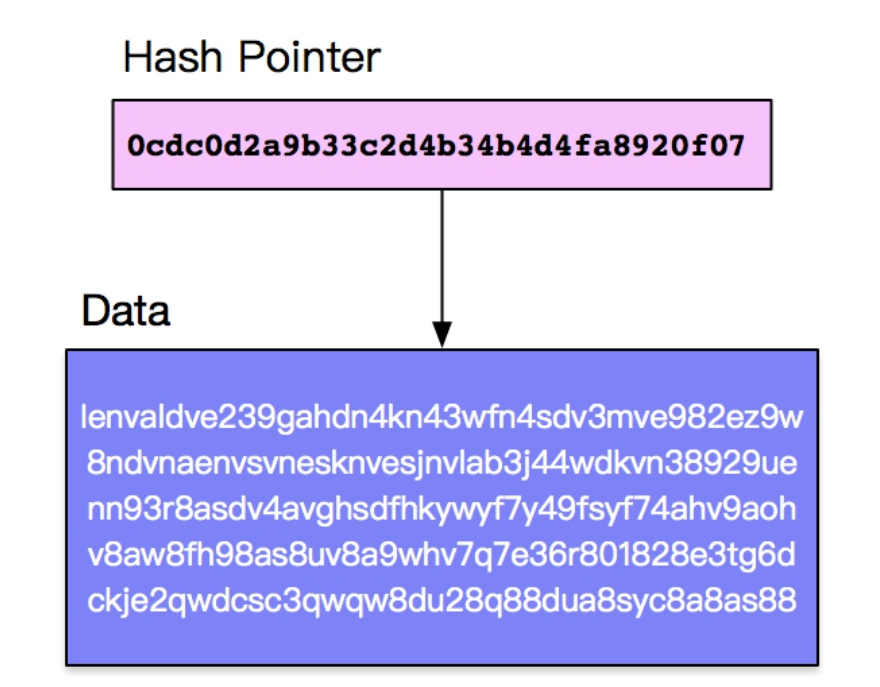
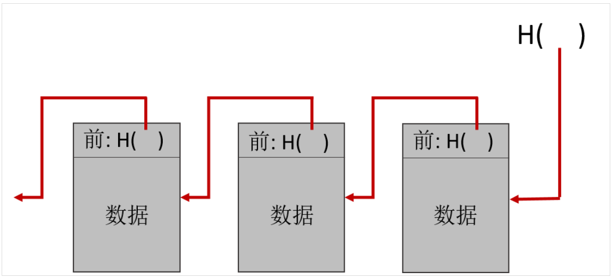

### 8.1.1 区块链数据结构
#### 8.1.1.1 链型区块链
&emsp;&emsp;为了实现数据的不可篡改性，区块链引入以区块为单位的链式结构。区块链简单来说就是按时间顺序将数据区块通过哈希指针的方式连接起来的一个链表。哈希指针是区块链里最常用的数据结构，一串数据的哈希值就是这串数据的指纹/摘要，因此就可以用这个哈希值来指向这串数据，如下图：

&emsp;&emsp;区块链的每一个区块都有对应本区块的哈希指针，除了创世区块（即第一个区块）之外，其他每个区块都存储了前一个区块的哈希指针，从而形成如下所示的一个链条，即区块链：

&emsp;&emsp;这样的数据结构可以保证数据无法篡改，一旦篡改了任何区块的数据，对应的哈希指针就会出错被检测到。
