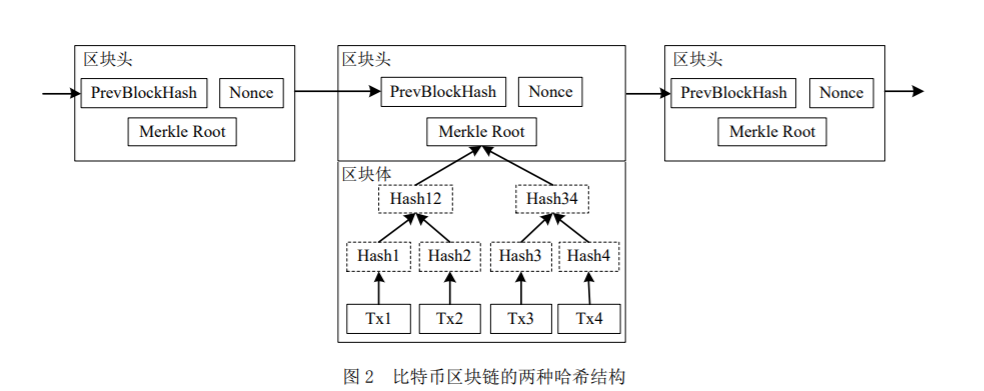
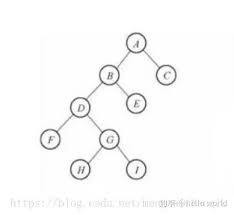
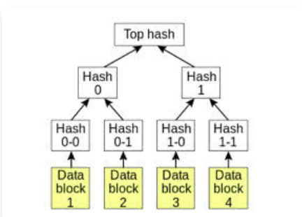

#### 8.1.1.2 树形区块链

&emsp;&emsp;以比特币为例，每个区块由区块头和区块体两部分组成，区块体中存放了自前一区块之后发生的多笔交易；区块头中存放了前块哈希（PreBlockHash）、随机数（Nonce）、Merkle 根等，区块链基于两种哈希结构保障了数据的不可篡改性，即Merkle树和区块链表，下图描述了比特币的区块链数据结构：

&emsp;&emsp;Merkle tree是一种哈希二叉树，1979年由Ralph Merkle发明。在计算机科学中，二叉树是每个节点最多有两个子树的树结构，每个节点代表一条结构化数据。通常子树被称作“左子树”（left subtree）和“右子树”（right subtree）。二叉树常被用于实现数据快速查询，二叉树如下图所示：

&emsp;&emsp;Merkle树由一个根节点（root）、一组中间节点和一组叶节点（leaf）组成。叶节点（leaf）包含存储数据或其哈希值，中间节点是它的两个孩子节点内容的哈希值，根节点也是由它的两个子节点内容的哈希值组成。所以Merkle树也称哈希树。叶节点存储的是数据文件，而非叶节点存储的是其子节点的哈希值（Hash，通过SHA1、SHA256等哈希算法计算而来），这些非叶子节点的Hash被称作路径哈希值（可以据其确定某个叶节点到根节点的路径）, 叶节点的Hash值是真实数据的Hash值。因为使用了树形结构, 其查询的时间复杂度为0(logn)，n是节点数量。

