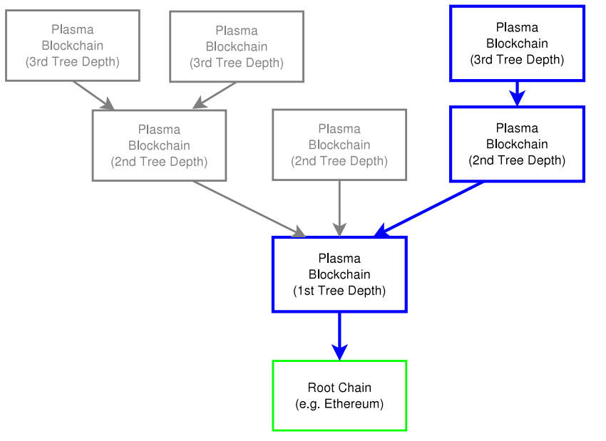

#### 8.1.1.2 树形区块链

&emsp;&emsp;Plasma设计了一种区块链树形框架，将主链作为树根、不同区块链作为主链的独立树形分支，并通过构建智能合约激励执行与强制执行框架，实现区块链的扩容计算。Plasma包括激励层、树形链组织结构、MapReduce计算框架、依赖于根链的共识机制和bitmap-UTXO结构这5个组件，协作实现合约持续计算、创建状态转移的欺诈证明、网络形态组织等功能。通过借鉴大数据并行计算模型MapReduce以及构建持续运作机制。Plasma预期可使区块链扩容至支持每秒10亿量级的状态更新。
