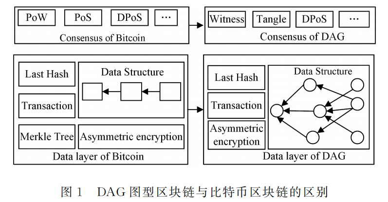

#### 8.1.1.3 图型区块链
&emsp;&emsp;尽管区块链系统被广泛研究和开发，但始终没能得到大规模应用。主要原因是目前大多数的区块链系统不能提供高吞吐率以及高可伸缩性来满足当前的大数据量或大交易量的处理需求[@zhang2018towards]。例如，比特币的区块链 有许多显著的缺点：

1. 可伸缩性差。随着系统中的节点数量不断增加，系统的吞吐率和存储容量无法提高；
2. 吞吐率低。比特币系统平均每秒处理的交易数量是７笔[@benvcic2018distributed]；
3. 确认延迟高。由于比特币区块产生速度为10min/个，确认延迟至少10min，而且由于分叉现象，一般认为60min后才可以认为交易被确认；
4. 高能耗。由于PoW机制，节点需要通过挖矿来争取记账权，因此会消耗大量的电力资源。据估计，比特币挖矿每年消耗数十太瓦时电量，足够一个中型国家全年的耗电量[@o2014bitcoin]。

&emsp;&emsp;为了使区块链能满足实际应用需求，必须解决以上的问题，尤其需要提高区块链系统的可伸缩性和吞吐率。针对这些问题，近年来涌现出一种基于有向无环图（DirectedAcyclicGraph，DAG）的方法，将单链结构变成图结构的图型区块链。图型区块链主要改进了比特币区块链的数据层和共识层，如下图所示：

&emsp;&emsp;图型区块链沿用比特币区块链的P2P网络结构来组织全网节点，P２P网络的特点是网络中的每个节点都是对等的地位且互相连接，不需要类似于C/S架构中的中心化服务器，也不需要特殊层级的节点，这保证了区块链系统的自治性、开放性和公平性，每个节点都承担着验证数据区块、保存数据区块、转发消息等任务。图型区块链采用的共识机制有基于权益证明(PoS)、见证人机制(Witness)、基于代理权益证明(DPoS)、缠结(Tangle)４种。图型区块链采用了以每笔交易为基本存储单位和处理单位的方式，相当于细粒度的区块。在执行过程中，由每笔交易对它之前的两笔或以上交易进行验证[@张长贵47区块链新技术综述]。
