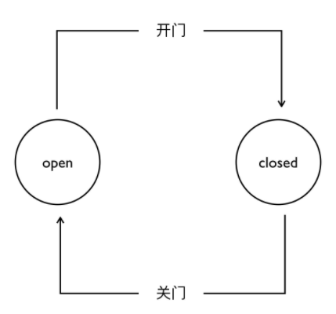

### 8.1.2 网络模型
#### 8.1.2.1 全局网络建模方法
**状态机**
&emsp;&emsp;状态机是有限状态自动机的简称，是现实事物运行规则抽象而成的一个数学模型。现实事物是有不同状态的，例如一个自动门，就有open和closed两种状态。我们通常所说的状态机是有限状态机，也就是被描述的事物的状态的数量是有限个，例如自动门的状态就是两个 open和closed。
&emsp;&emsp;状态机，也就是State Machine，不是指一台实际机器，而是指一个数学模型。一般就是指一张状态转换图。例如，根据自动门的运行规则，我们可以抽象出下面这张图。

&emsp;&emsp;切换成区块链内部视角，区块链除了各个区块外，本质上还是离不开网络。可以将区块生产节点理解为生态系统中的生产者，其他节点基于区块完成交易，验证，广播等各个动作，可以理解为消费者。每个节点都有不同的状态，通过状态机我们能描述清楚区块链的网络节点部分。例如，智能合约接收外界输入，内部执行代码（执行动作，进行状态转换），最终达到一个新的状态。

**网络模型**
&emsp;&emsp;比特币网络中的节点主要有四大功能：钱包、挖矿、区块链数据库、网络路由。每个节点都会有路由的功能，但是其他功能并不一定全部具备，一般属于比特币核心节点才会全部包含四种功能。包含所有功能的节点也叫全节点。

&emsp;&emsp;以太坊网络和比特币一样，以太坊也具备钱包、挖矿、区块链数据库、区块路由四大功能，也存在不同类型的节点，与比特币P2P网络结构最大的不同在于，以太坊的P2P是有结构的。其网络采用 Kademlia（Kad）算法实现，使用该算法可以快速而又准确的路由、定位数据的问题。

**维护全局状态的一致性**

&emsp;&emsp;全局状态的一致性可以分成强一致性和最终一致性，以下介绍PoW/PoS共识算法如何来维护全局状态的一致性：
1. PoW（工作量证明）：矿工通过把网络尚未记录的现有交易打包到一个区块，然后不断遍历尝试来寻找一个随机数，找到满足条件的随机数就相当于获得了区块链的本轮记账权。矿工把满足条件的区块在网络中广播出去，全网其他节点在验证该区块满足挖矿难度条件，同时区块里的交易数据符合协议规范后，将各自把该区块链接到自己版本的区块链上从而在全网形成对当前网络状态的共识，达成全局状态的一致性；
2. PoS（权益证明）：要求节点提供拥有一定数量的代币证明来获取竞争区块链记账权的一种分布式共识机制，从而可以达成全局状态的一致性。

&emsp;&emsp;全局网络建模是指区块链中所有全节点通过共识机制对等协商，共同维护区块链。全局网络建模方法下的区块链节点存储完整的账本数据（账户模型下还包括状态数据），并执行所有交易，这种建模方法对系统的存储、计算和网络造成了较大压力，对参与的节点提出了更高的配置要求。