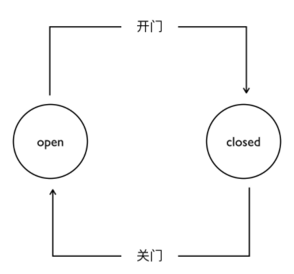

### 8.1.2 网络模型
#### 8.1.2.2 分片网络建模方法
&emsp;&emsp;分片技术在运用于区块链之前，已经在数据库领域得到了广泛运用，用于提升数据库的吞吐能力，例如OpenDHT，Google spanner等。简单来说，分片技术将数据库的不同表（或相同表中的不同行）分别放置在不同的服务器中，根据数据访问请求的对象，将请求分发到对应的服务器。从而，数据库的响应能力能随着服务器数量的增加呈线性增长，极大地提升了数据库的服务能力。类似地，在区块链中，可以将单链拆分多条并行运行的子链（分片）。从实现的角度，分片可以进一步分为交易分片和状态分片。交易分片根据特定规则，将网络中的交易分发到不同的子链，各子链并行验证和打包交易，从而使区块链的吞吐量实现质的提升。状态分片将区块链的验证状态（广义上来讲，包括历史数据）分为多个不相交的子集，各分片只需保存其中的一个状态子集和处理与状态相关的交易，从而降低每个节点的数据存储量，如图1所示。实现状态分片往往意味着同时实现交易分片[@陈幻2020一种面向公有链的轻量级可扩展技术]。

**区块链分片技术研究现状**

 &emsp;&emsp;Elastico是最早面向公有链的交易分片技术。首先，各节点需要进行第1轮工作量证明（proof ofwork,PoW）建立身份，避免遭受女巫攻击。为了防止恶意节点集中到特定分片中，利用绝对的算力（或权益）对该分片进行攻击（称为１％攻击），需要将节点随机地分配到各个分片。分片形成后，分片内部采用PBFT协议达成共识，形成micro block发往0号分片。0号分片通过验证和打包mirco block，再次运行PBFT共识，生成最终区块。然而，Elastico不支持跨片交易处理，并且分片内部采用传统的PBFT协议，参与共识的节点数量较少，具有较高的错误率。此外，Elastico为了避免1%攻击，需要周期性地对节点进行重新分配。为了避免每次分片切换时下载大量新分片的数据，各节点需要保存所有分片的数据，节点存储压力较大。

 &emsp;&emsp;Zillqa团队在Elastico的基础上，进行了架构和性能优化。在设计架构上，提出双链架构，一条是交易链，一条是目录服务链。交易链上保存交易数据，目录服务链存放矿工元数据信息。其中最近的n个节点形成最终委员会, 负责划分分片以及收集各分片的micro block形成final block。在共识方面，Zillqa借鉴了Elastico多重签名技术,，并用数字签名代替MAC，极大提升了PBFT的扩展性，使得PBFT可以适用于几百个节点。此外，Zillqa第1次创新性地提出数据流编程框架，利用全网算力来实现大规模计算，如MapReduce和神经网络计算等。虽然Zillqa在共识方面有较大改善，但是依然没有实现状态分片。

&emsp;&emsp;OmniLedger首次实现了状态分片并提出了并行共识算法。通过移除块的全序要求，将块组织成有向无环图(Directed Acyclic Graph，DAG) 结构，增加了系统的吞吐量、降低了交易确认延迟。此外，OmniLedger使用原子提交协议来处理跨分片交易；并使用账本剪枝技术，引入检查点，将检查点之前的历史数据进行裁剪，降低节点的存储压力。然而，原子提交协议采用以用户为中心的2阶段提交方法，需要用户参与跨分片交易处理；每次分片切换，都会导致状态迁移。

&emsp;&emsp;RapidChain在OmniLedger的基础上，加入了基于纠删码的信息分发技术来加快大区块的传播速度，实现了覆盖通信、计算与存储的全分片技术。为了降低状态迁移代价，RapidChain采用了Cuckoo协议，每次分片切换只需替换部分节点。

&emsp;&emsp;总体来说，分片网络建模方式提高了执行效率，但是分片的安全性与稳定性、跨分片事务处理等方面存在重大挑战。
