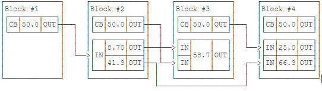

### 8.1.3 数据模型

#### 8.1.3.1 区块链数据模型（UTXO）

&emsp;&emsp;以比特币为代表的早期代币系统多采用UTXO模型，比特币由链式区块组成，每个区块包含一个或多个交易，其中每个交易是由若干个输入（Input）和若干个输出（Output）构成，除创世区块以外的每个Output指向下一个区块的Input。如图

&emsp;&emsp;还未指向下一个Input的Ouput称为UTXO（Unspent Transaction Output），即未花费的交易输出，如图Block #4有一笔50.0的UTXO。每个比特币地址拥有的比特币数量就是由多笔UTXO交易组成，UTXO是比特币系统的核心。并且，每个UTXO都是一次性的，即一次必须消耗完，这种一次性的机制避免同一个比特币被多次花费的问题，也叫“双花问题”。

&emsp;&emsp;相比于Account模型的记账方式，UTXO无法直接看到账户余额，需要将每个UTXO里面的比特币累加起来，得出账户总量。这种方式的表达能力较弱，无法支持复杂场景。因此在出现了以UTXO为基础的EUTXO。

&emsp;&emsp;EUTXO（The Extended UTXO Model）

* EUTXO-1：在UTXO的基础上，扩展具有增强的脚本功能的基本UTXO模型，允许实现复杂的智能契约。每个事务都具有一个有效间隔，仅在当前插槽号位于事务的有效期内时，才能处理事务。Validator脚本使用有关挂起事务的信息（即假定验证成功，即将发生的事务）。 这些信息包含在称为上下文的结构中，在可能出现歧义的情况下，我们可以将此信息称为验证上下文。

* EUTXO-2：在EUTXO-1的基础上，添加多种频率特性，允许用户定义自定义货币和不可替代的令牌。EUTXO-2模型允许无限制数量的货币，每个自定义货币都有一个唯一的标识符。不可替代的令牌(NFT)是一个唯一的对象，可以传输到其他用户，但不能复制。NFT在许多区块链应用程序中已被证明很有用，可以表示游戏中某个对象的所有权。

&emsp;&emsp;比特币客户端通过执行一个用类Forth脚本语言编写的脚本验证比特币交易。锁定脚本被写入UTXO，同时往往包含一个用同种脚本语言编写的签名。当一笔比特币交易被验证时，每一个输入值中的解锁脚本被与其对应的锁定脚本同时（互不干扰地）执行，从而查看这笔交易是否满足使用条件。

&emsp;&emsp;Chimeric Ledgers是一种UTXO和账户类型相互转换的方法。基于UTXO的交易类似现金的转移，基于账户为基础的交易类似银行账户转移，存款总额等于存款人各类现金、账户的总和。UTXO的Input被认为已经花费，并且存款人地址的账户增加的金额等于已经花费的金额减去手续费，再加上其他金额。提现交易则相反。提现将取款人地址的账户余额减去取款的硬币和纸币的总价值加上手续费减去其他的金额。

