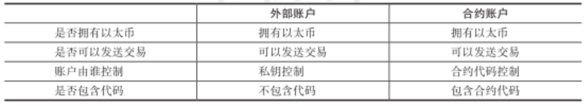

#### 8.1.3.2 账户数据模型
**账户模型介绍**

&emsp;&emsp;以太坊中的账户使用的是Account模型，并不是比特币中的UXTO模型，以太坊中有两类账户：外部账户（EOA）和合约账户。

&emsp;&emsp;外部账户由私钥控制，每个账户都有自己的余额。拥有者可以通过创建和签名一笔交易从自己的外部账户发送消息，而接受方账户则不计入该金额，外部账户的地址是由公钥决定的。

&emsp;&emsp;合约账户由代码控制。在一些情况下，当合约账户收到一条消息，合约账户的代码就会被激活，允许它对内部存储进行读取和写入，发送其他或者创建合约。合约账户的地址是创建合约时确定的，合约账户地址由合约创建者的地址和该地址发出过的交易数量计算得到，地址发出过的交易数量也被称作nonce。

**账户内部结构**

&emsp;&emsp;账户由四个组成部分，不论账户类型是什么，都存在这四个组成部分：
*   nonce：如果账户是一个外部账户，nonce代表从该账户地址发送过的交易数量，该数量会出现在交易的字段中，起到防止双花的目的。如果账户是一个合约账户，nonce代表由该账户创建过的合约数量。
*   balance：该账户拥有的余额，以Wei为单位。
*   storageRoot：该账户的存储内容是Merkle Patricia树的根节点哈希值。Merkle树会将此账户存储内容的哈希值进行编码，默认为空值。
*   codeHash：如果是外部账户，codeHash是一个空字符串的哈希值，如果是合约账户，codeHash是该账户EVM code（编译后的智能合约字节码）的哈希值。和账户的其他字段不同，codeHash是不可变的，可以用来从状态数据库中获得相应的EVM code。

**基于账户模型的加密货币**

&emsp;&emsp;以太坊选择了无现金的基于账户的系统。一个地址被看作一个账户，一个交易将一个值从一个账户转移到另一个账户。每一笔交易都有一个唯一的nonce，以防止双花攻击。为了允许只创建货币并将其分配给接收者或只从发送者那里取钱并将其作为使用的交易，因此发送者和接收者都是可选的[@zahnentferner2018chimeric]。