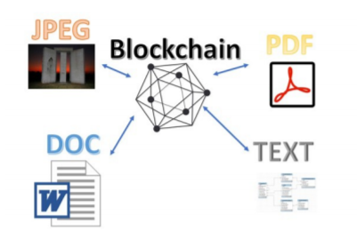

### 8.2.2 链下存储机制
&emsp;&emsp;在新的区块链项目中使用传统数据存储会带来几个严重的问题。例如：访问问题、安全问题、加密问题、性能问题、成功问题等。因为非交易数据（如图片、合同、PDF和个人信息等）不应该存储在区块链上，因此，新的区块链项目中需要某种形式的链下存储或sideDB存储。通常，链下数据为非结构化数据，所以应该生成链下项目的哈希值或签名，并将这些哈希值或签名存储在区块链中，而链下项目本身则存储在云端或近云存储中。

&emsp;&emsp;链下数据指的是因规模太大而无法高效存储在区块链上、或者需要能够变更/删除的任意非交易数据。图1展示了一些链下数据类型示例。

&emsp;&emsp;在使用链下存储时，区块链只存储事实（总数、集合、交易详细信息），这些事实源自链下存储的数据（文档、图片、PDF文件和列表数据）之间的交集，或者会导致链下存储的数据产生交集。新的数据组织要求会导致效率下滑。对于这一问题，唯一办法是构建一个由存储和服务器资源组成的共享网络，以便为区块链联合体成员提供所需的安全和共享环境。每当数据对象被访问时，它必须利用存储的哈希值进行验证，证明该对象与一开始存储的对象一模一样。每个对象应该存储在不只一个数据存储中，以确保某个节点的丢失不会导致大量数据丢失。此外，一旦节点在恢复后重新加入联合体，则需要采取一种机制来同步链下引用，并重新平衡链下数据。为了满足这类要求，需要采用新的区块链专用链下存储资产和新的存储访问模式。
