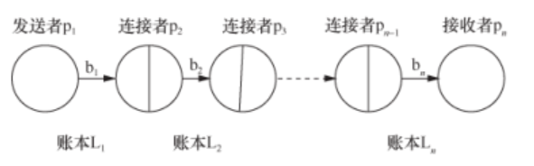

#### 8.2.2.2 公证人模型
&emsp;&emsp;公证人模式是基于interledger协议创造的一种技术框架，与现实世界中的中介机制类似，引入交易双方能够共同信任的第三方充当公证人来作为中介，公证人既可以自动的监听和响应来自链上的交易请求和确认信息，也可以主动地对发生的事件或请求进行监听和响应。公证人模式分为单签名公证人¸多签名公证人和分布式签名公证人（分布式签名公证人模式采用安全多方计算的思想，安全性更高，但实现难度也更大。以下分别展开介绍这三种公证人模式：
1. 单签名公证人模型：也叫中心化公证人模型，通常由单一指定的独立节点或者机构充当，它同时承担了数据收集、交易确认、验证的任务。这是最简单的模式。其优点在于处理速度较快，技术结构相对简单，但是这种方式的问题也很明显，即中心化的公证人的安全风险；
2. 多签名公证人模型：通常由多位公证人在各自账本上共同签名达成共识后才能完成交易，多重签名公证人的每一个节点都拥有自己的一个密钥，只有当达到一定的公证人签名数量或比例时，跨链交易才能被确认；
3. 分布式签名公证人模型：分布式签名公证人模型和多签名公证人模型最大的区别在于签名方式不同，它采用了多方计算（Multi-Party Computation）的思想，安全性更高，实现也更复杂。对于跨链交易，系统仅产生一个密钥，密钥以碎片形式发送给每个公证人节点。

&emsp;&emsp;无论使用哪种签名方式，公证人模型核心解决的问题体现在两方面：

1. 保障跨链交易原子性：即跨链交易要么发生，要么不发生，否则两条链的不一致和不同步状态将成为跨链交易最大的系统漏洞，是跨链交易必须要解决的难点。
2. 完成对另一条链交易确认：包含了两个层次的问题，一是确认交易已经发生并且上链，写入了区块账本；二是该交易已经获得了系统足够多区块的确认，这样由于系统发生重构而导致交易无效的概率将非常低。

&emsp;&emsp;瑞波的InterLedger协议中原子模式的实现方式是典型的公证人模型，在InterLedger协议中，包括发送者、连接者、接收者和公证人等角色。发送者把资产转给公证人组多签地址进行资产托管，接收者确认收到转账后在收据上签名。当前账本公证人根据收据将资产转给连接者[@郭朝4区块链跨链技术分析]。支付链如图1所示。

