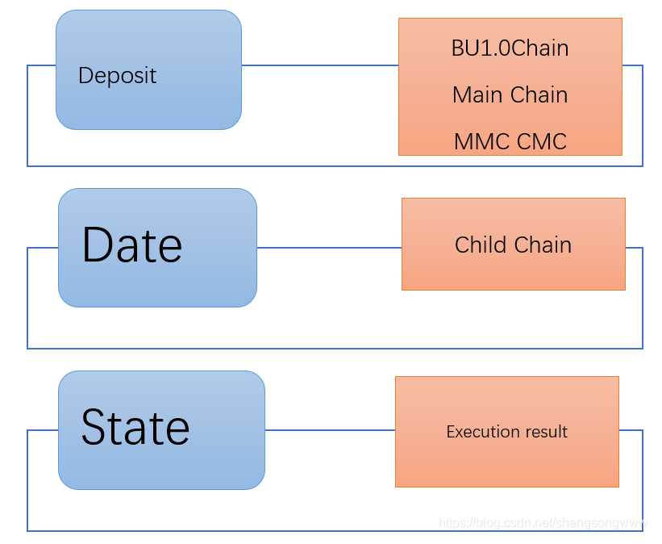
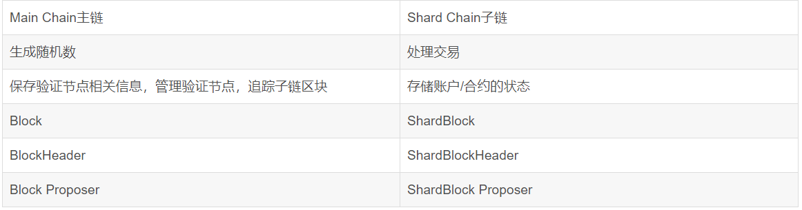

### 8.2.3 多链存储机制
&emsp;&emsp;多链，即抛弃了“一链治所有”的传统方案，采用“一链一合约”的新方案重新设计了一个保障每个合约都能正常运行的公链。这一创新极大程度上简化了架构，降低了数据处理压力，确保一条链上流量激增不会影响到另一条链的效率，在链上进行的任何业务都不会收到其他业务干扰，有效实现了资源隔离。

**设计架构**

&emsp;&emsp;多链一共分为3层，链管理层SMC，通过一个合约SMC管理验证节点押金，验证节点随机抽样等；Date为具体的交易数据层，各个子链分别维护各个子链的全状态数据和主链的全状态；State层主要是交易的产生层，也可以说是智能合约的执行层。

**主链和子链的职责**

&emsp;&emsp;主链的作用是生成随机数，保存验证节点相关信息，管理验证节点，追踪子链区块，子链的作用是处理交易，存储账户合约的状态。

&emsp;&emsp;总的来说，单链只能存储、收发某一主链上的加密资产和数据，在一定程度上，它是公链生态的入口。多链可以存储、收发多条公链上的资产和数据，为用户管理各位公链资产提供极大的便利，减轻了用户管理多链资产的负担。
