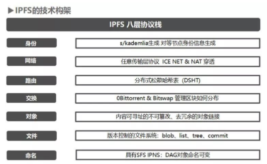
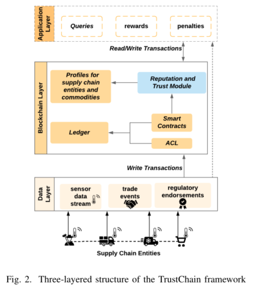

### 8.3.1 区块链链上链下融合
#### 8.3.1.1 数据融合
&emsp;&emsp;数据融合指通过链上存储数据的关键信息、链下存储数据内容实现信息系统和区块链各存储部分数据的情况下实现业务融合。以下简要介绍几个例子：

1. Juan Benet于2014年提出星际文件系统（InterPlanetary File System，IPFS），IPFS是一种点对点分布式文件系统，旨在将所有计算设备与同一文件系统连接起来。在某些方面，IPFS与Web相似，但是IPFS可以看作是一个BitTorrent群，可以在一个Git存储库中交换对象。IPFS中的存储证明包括复制证明和时空证明。复制证明（Proof of Replication，PoRep)是一个新型的存储证明,可以让证明人提供存储证明给用户，证明用户的数据已经被复制存储到证明人唯一的专用物理存储设备上。时空证明POST（Proof of Spacetime，PoSt）是Filecoin项目采用的共识机制,使用用户存储的数据本身作为算力大小的证明。IPFS技术架构如下图所示：
2. Azaria等提出基于区块链的分布式电子医疗记录（electronic medical records，EMRS）管理模型MedRec。该系统为患者提供了全面、不变的日志，患者可以跨提供商和治疗地点轻松访问其医疗信息。MedRec利用独特的区块链属性使身份验证、机密性、问责制和数据共享，模块化设计与提供商现有的本地数据存储解决方案集成在一起，促进了互操作性。MedRec激励医学利益相关者（研究人员，公共卫生当局等）以区块链“矿工”的身份参与网络，访问汇总的匿名数据作为挖掘奖励，以换取通过工作量证明维持和保护网络。总之，MedRec促进了数据经济学的兴起，提供了大数据来增强研究人员的能力，同时让患者和提供者选择发布元数据的选择[@azaria2016medrec];
3. Malik等人提出基于区块链结合IoT的供应链信任管理模型，用于解决与商品质量以及在区块链上的实体记录数据相关的信任问题。模型使用Consortium区块链来跟踪供应链参与者之间的交互，并根据交互动态分配信任和信誉分数。该框架有助于提供代理和资产的信誉模型，可以为同一参与者分配特定产品的声誉， 使用智能合约实现自动化和效率[@malik2019trustchain]。
