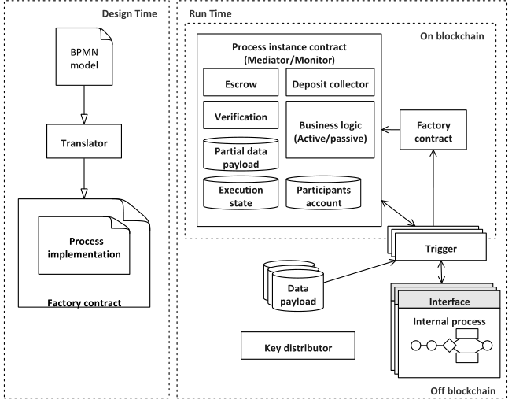
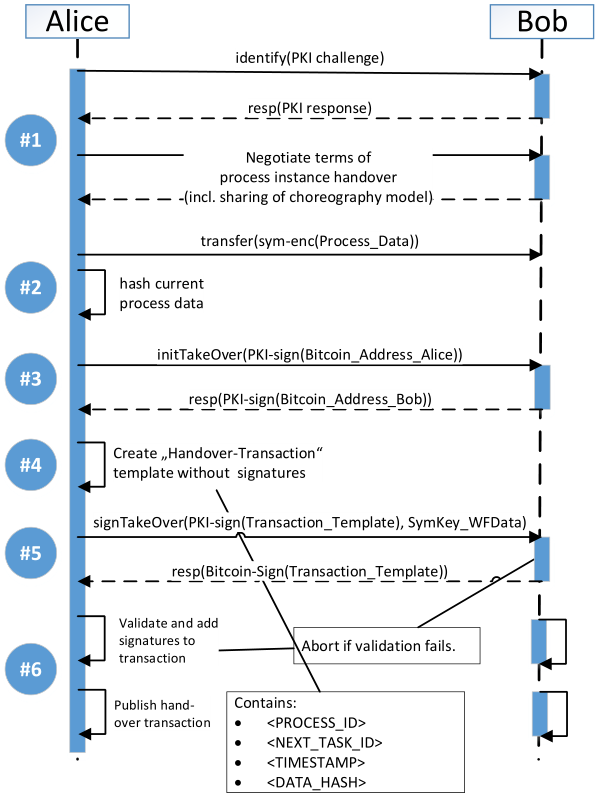

### 8.3.1 区块链链上链下融合
#### 8.3.1.2 流程融合
&emsp;&emsp;流程融合指信息系统与区块链系统各执行部分流程的情况下实现业务融合，主要包括：链下执行，链上存储结果、链上链下混合执行。

&emsp;&emsp;然而，在融合的过程中缺乏信任问题成为避免不了的障碍之一，因此Weber等人设计了一种基于区块链的链上链下流程协同机制。通过区块链技术在不受信任的参与者网络上进行去中心化和事务数据共享，它可以用来找到关于协作各方共享状态的协议，而不需要信任一个中央权威机构或任何特定的参与者。

&emsp;&emsp;方法概述如图1所示，通过区块链的两种方式来促进融合过程：
1. 区块链作为编排监视器，通过观察消息交换来存储所有相关参与者的流程执行状态。在此设置中，区块链充当不可变数据存储，以共享流程执行状态来创建审计跟踪。智能合约检查交互过程是否符合编排模型。另外，编排监视器可以用于管理自动付款点和托管；
2. 区块链作为参与者之间的主动中介，协调协同过程的执行。使用智能合约驱动流程并实现数据转换或计算[@weber2016untrusted]。

&emsp;&emsp;另外，在编排过程中，对流程实例的控制是在独立各方之间共享的，在流程运行时期间，没有一方拥有完全的控制权。然而，为了记录文档、记帐，有必要在运行时监控和验证流程实例。因此，为了实现业务流程运行时验证，Prybila等人基于比特币区块链设计了一种运行时验证的业务流程机制，通过探索了比特币区块链的适用性，以创建一个新的编排解决方案。以下为该方法的概述，流程图如图2所示：

&emsp;&emsp;流程所有者在新流程实例的开始选择一个免费的比特币输出，作为编排的控制令牌。这个控制令牌存储进程的执行状态。同时，区块链成为令牌的去中心化存储。拥有令牌的人负责执行编排的一部分，即一个活动/任务。要在流程实例中启用并行性，可以拆分和联接令牌。参与者可以通过提交传播令牌的新事务来记录进程和移交给其他参与者的过程。

&emsp;&emsp;每个事务都添加了流程当前状态的附加元数据。由于比特币交易是基于推送的，令牌发送方通过发布各自的交易来批准从一个参与者到另一个参与者的交接。然而，令牌接收方的批准也必须记录在事务中。因此，令牌接收者的签名也被嵌入到存储在事务中的流程元数据中。

&emsp;&emsp;如果这个交接令牌的过程以某种方式违反了编排契约的约定，流程所有者可以从涉及的参与者处进行惩罚。同时，参与者也有可能证明他们成功地参与了编排，从而获得奖励。为了保持编排的灵活性，参与者并不是在流程设计时预先确定的，而是在流程运行时动态地选择。不利的一面是，这妨碍了正确流程序列的执行。因此，流程所有者可以通过观察区块链来监视实例的进度。如果某个流程实例的执行偏离了给定的流程模型，那么流程所有者和该实例的所有其他编排参与者可以检测到这一点并对其作出反应[@prybila2020runtime]。

