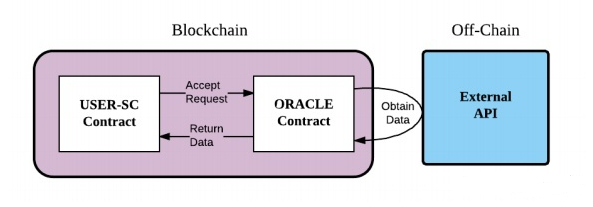
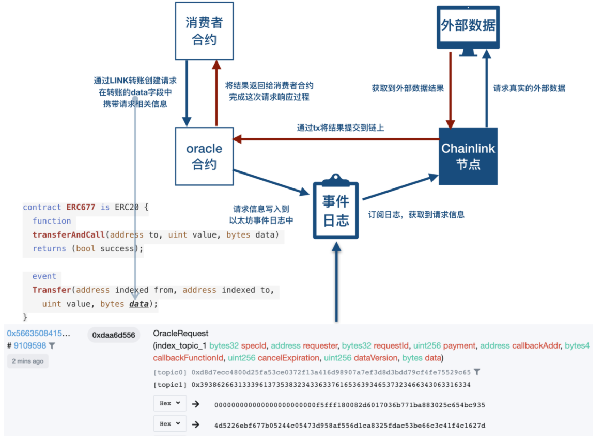
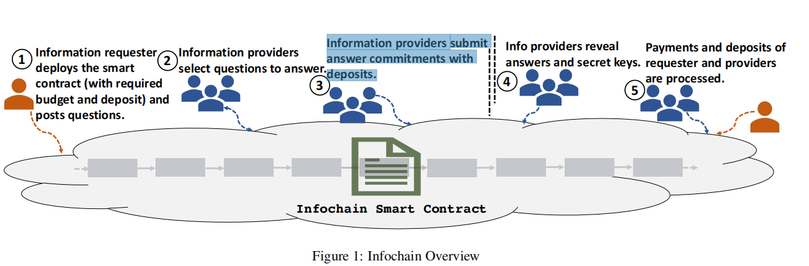

#### 8.3.1.3 输入输出融合

&emsp;&emsp;区块链是一个确定性的、封闭的系统环境，目前区块链只能获取到链内的数据，而不能获取到链外真实世界的数据，区块链与现实世界是割裂的。一般智能合约的执行需要触发条件，当智能合约的触发条件是外部信息时（链下），就必须需要预言机来提供数据服务，通过预言机将现实世界的数据输入到区块链上，因为智能合约不支持对外请求。区块链是确定性的环境，不允许不确定的事情或因素，智能合约不管何时何地运行都必须是一致的结果，所以虚拟机（VM）不能让智能合约有 network call（网络调用），这可能导致结果就是不确定的。目前链上链下数据的协同主要有以下4大发展方向：

1. 大规模高性能点对点网络。围绕区块链应用，原来大规模点对点的网络，这个才是最重要，因为区块链本来就是点对点传输的。如果说网络技术没有突破，区块链系统性能是很难提升。
2. 模块化安全密码学协议。本来区块链就是分布式加上密码。安全密码学协议模块化，区块链子系统嵌入不同的，模块化安全密码学协议也是研究方面。
3. 高性能可编程计算引擎。我们希望用户不同的智能合约用不同的编程语言来编，既然用不同的编程语言，那你就需要高性能可编程计算引擎。
4. 可定义的数据分发协议。

**预言机（Oracle）是什么？**

> 区块链链下信息写入区块链的机制，一般被称为预言机（Oracle Mechanism）

&emsp;&emsp;预言机的功能就是将外界信息写入到区块链内，完成区块链与现实世界的数据互通。它允许确定的智能合约对不确定的外部世界作出反应，是智能合约与外部进行数据交互的唯一途径，也是区块链与现实世界进行数据交互的接口。

&emsp;&emsp;在《精通以太坊（Matering Ethereum）》一书中，提出了三种预言机的设计模式，分别是：

* 立即读取（immediate-read）
* 发布/订阅（publish–subscribe）
* 请求/响应（request–response）

**预言机的工作流程**

&emsp;&emsp;链上的智能合约把相应的请求发给链上的Oracle合约，然后通过链下的API接口获得外部数据。即外部数据给链上的Oracle合约，Oracle合约再把数据回传给用户的智能合约。这与传统互联网中的直接代码获取数据不同，因为区块链与外部世界进行数据交互是不允许这与操作的。


**Chainlink**

&emsp;&emsp;Chainlink是一个去中心化的预言机项目，它的作用就是以最安全的方式向区块链提供现实世界中产生的数据。Chainlink在基本的预言机原理的实现方式之上，围绕LINK token通过经济激励建立了一个良性循环的生态系统。Chainlink预言机需要通过LINK token的转账来实现触发。LINK是以太坊网路上的ERC677合约。

&emsp;&emsp;基于LINK ERC677 token完成的预言机功能，就属于 **请求/响应模式** 的设计模式。这是一种较为复杂的模式，图中展示的是一个不含有聚合过程的简单请求/相应流程。


&emsp;&emsp;以Chainlink提供的TestnetConsumer合约中的一个requestEthereumPrice方法为例来简单讲一下请求响应的流程。这个函数定义如下：
```
function requestEthereumPrice(address _oracle, string _jobId) public onlyOwner
{
  Chainlink.Request memory req = buildChainlinkRequest(stringToBytes32(_jobId), this, this.fulfillEthereumPrice.selector);
  req.add("get", "https://min-api.cryptocompare.com/data/price?fsym=ETH&tsyms=USD");
  req.add("path", "USD");
  req.addInt("times", 100);
  sendChainlinkRequestTo(_oracle, req, ORACLE_PAYMENT);
}
```
&emsp;&emsp;该实现的功能就是从指定的API (cryptocompare)获取ETH/USD的交易价格。函数传入的参数是指定的Oracle地址和JobId。将一些列的请求参数组好后，调用sendChainlinkRequestTo方法将请求发出。

**Infochain**

&emsp;&emsp;Infochain是基于区块链的分布式、不可信、可见的预言机，在以太坊区块链上实现去中心化、无信任和透明的区块链预言机。与传统的去中心化系统的实现方式不同，Infochain通过实施博弈论的同行一致性机制来解决真实性问题，证明即使当代理有外部动机误报信息，对等一致性机制可以得出引出真实的信息。



Infochain是基于预言机的去中心化的分布式问答模型，其工作流程分为5步：

1. 信息请求者部署智能合约(包含所需的预算和定金)并发布问题。
2. 信息提供者选择问题来回答。
3. 信息提供者提交回答承诺与存款。
4. 信息提供者揭示答案和秘密密钥。
5. 处理请求者和提供者的付款和存款。

由此可以保证通过Infochain获取的数据是真实的。
