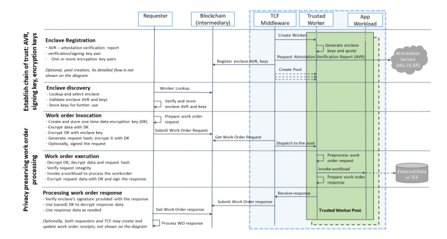

## 8.4 隐私和安全
### 8.4.1 区块链共识算法的安全

&emsp;&emsp;可信执行环境（Trused Execution Environment，TEE）是处理器的安全区域，它运行在一个独立的环境中且与操作系统并行运行，通过同时使用硬件和软件来保护数据和代码，确保TEE中加载的代码和数据的机密性和完整性。在TEE中运行的受信任应用程序可以访问设备主处理器和内存的全部功能，硬件隔离保护这些组件不受主操作系统中运行的用户安装应用程序的影响，TEE中的软件和加密隔离相互保护不同的受信任应用程序。

&emsp;&emsp;近年来，业界已引入了一些硬件安全功能，例如Intel Software Guard Extension（SGX）、受信任的执行技术TXT和ARM TrustZone，以支持在计算平台上设置TEE。尽管没有任何一种计算系统可以完全安全，但是通过利用基于硬件的TEE，人们可以模拟并提供接近“理想世界”的安全属性，甚至云提供商也可以移出信任域。

&emsp;&emsp;在Avalon项目中，使用区块链来执行执行策略并确保事务可审计性，而关联的脱链可信计算资源则执行事务。通过使用可信计算选项，开发人员可以加快吞吐量并改善数据隐私。可信计算服务主持可信赖的工人，并使它们可用于通过前端或命令行工具执行请求者提交的工作订单。工作订单也可以由在分布式分类帐技术上运行的（企业应用程序特定）智能合约提交。下图描绘了整体执行流程：