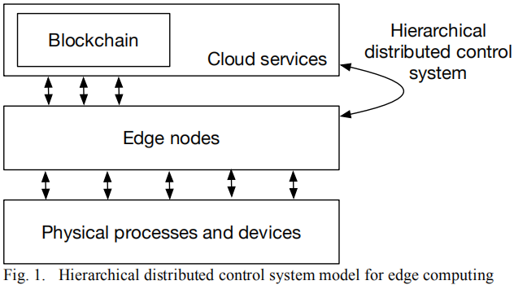
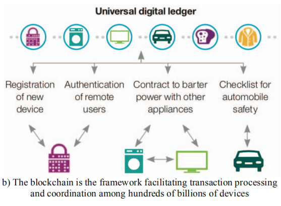
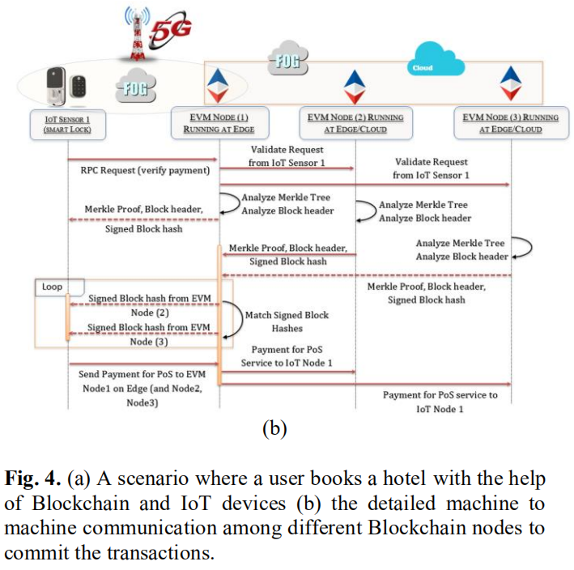
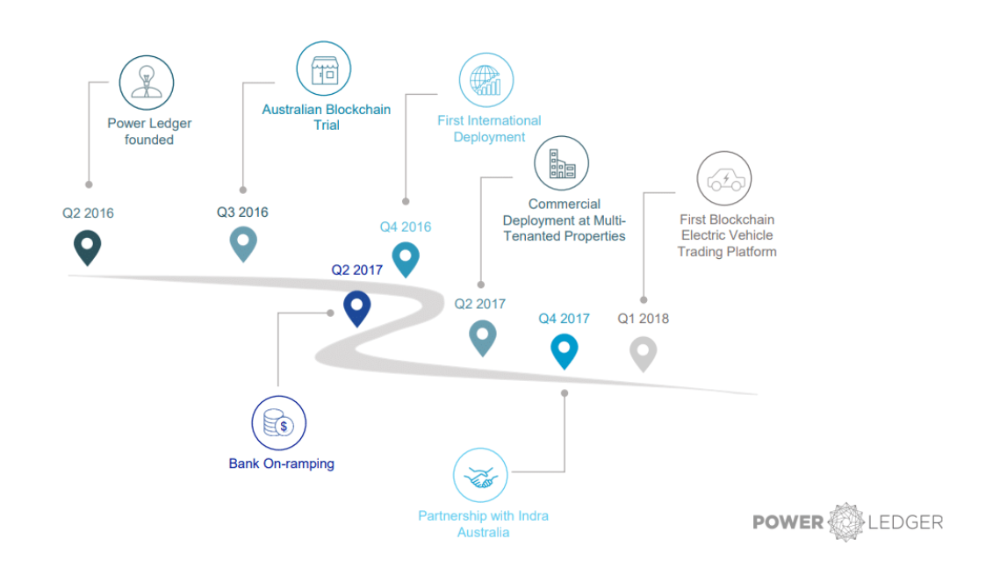
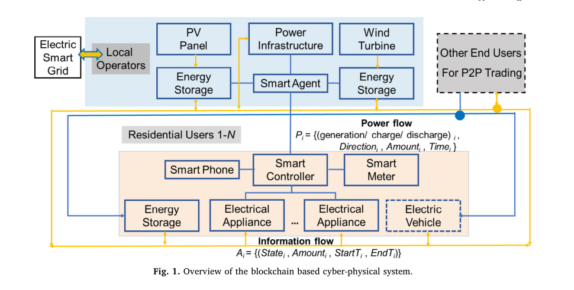
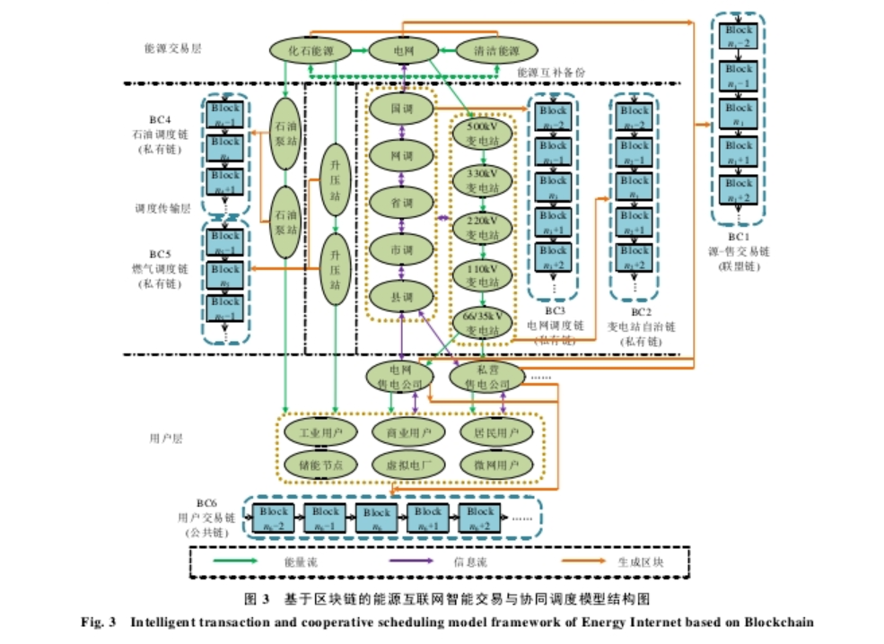

### 区块链与云边端体系结构

&emsp;&emsp;边缘计算可以在网络边缘处理或预处理终端收集或产生的数据，无需将全部数据上传云端，从而减轻云计算中心的网络负载与计算能耗、降低服务延迟与隐私泄漏风险。但在处理复杂统计与分析任务时，边缘计算服务有限的计算和存储能力不能满足任务的需求，需要将边缘计算和云计算结合，互为补充，同时结合终端设备产生的海量数据建构几个层次型的云边端结构来满足复杂任务的需求。在云边端融合架构中，由于边缘服务器或不同的云服务节点等可能分属不同利益方，且在复杂环境下云边端系统易受到攻击，引入区块链技术为解决这些问题提供了新思路。

#### 8.6.2.1 融合区块链的云边端体系架构

&emsp;&emsp;边缘计算与区块链融合能提高物联设备整体效能。以物联网设备群为例，一方面移动边缘计算可以充当物联设备的“局部大脑”，存储和处理同一场景中不同物联设备传回的数据，并优化和修正各种设备的工作状态和路径，从而达到场景整体应用最优。另一方面，物联终端设备可以将数据“寄存”到边缘计算服务器，并在区块链技术的帮助下保证数据的可靠性和安全性，同时也为将来物联设备按服务收费等多种发展方式提供了可能性。

1. Stanciu提出的一个分层分布控制系统，用于在连接到网络的终端设备附近提供计算资源，在物联网、智能电网、医疗保健、智能家居等领域有着广泛的应用。该系统为三层架构，分别是云服务层、边缘层以及物理层。其中，云服务层和边缘层是基于Hyperledger Fabric的区块链解决方案，其中的功能块将作为主管级的智能合约实现。与在执行层执行的负责实际过程控制的边缘节点的集成是基于微服务架构的，Docker容器实现功能块，而Kubernetes平台用于协调容器跨边缘资源的执行。这种类型的架构被用于边缘计算模型，既可以为监测环境的大规模传感器网络提供计算资源，也可以提供基于数据处理和云资源集成的智能服务。具体如图085211-1所示。

#### 8.6.2.2 智能家居

&emsp;&emsp;随着物联网技术的发展，家具的智能化和联网化趋势愈发明显，随之而来的安全问题也越来越得到重视。区块链以及智能合约被广泛认为是能够解决大量智能终端联网的方案之一。

1. Dorri提出一个轻量级的区块链实例化架构，适合在物联网中使用。该架构在智能家居环境中得到较好的表现，由三个主要部分组成，即:云存储、覆盖网络和智能家居。在这个架构中每个智能家居系统都配备一个随时在线的高计算资源设备，称为“矿工”，负责处理与家居内外的所有通信。为实现用户对智能家居事务的控制，该矿工设备会给相应的设备分发秘钥，设备之间的通信通过秘钥进行安全同行。该计算设备还保留一个私有的、安全的区块链账本，用于控制和审计通信。根据机密性、完整性和可用性等基本安全目标对该系统进行安全性分析，结果表明Dorri的基于区块链的智能家居框架是安全的。

1. 如今，智能家居系统的众多应用为用户提供选择，包括降低能耗、设备故障的警告、高可用设备和软件、诊断等。智能家居环境的互联网连接、动态和异构特性带来新的安全、认证和隐私挑战。在智能家居系统中，用户优先考虑设备便利性和连通性，反而不会太重视设备以及用户个人的隐私。针对此问题，Thanh提出一种基于区块链技术的智能家居数据隐私保护方法，即基于物联网区块链的智能家居，即SHIB。SHIB体系结构具有数据私密性、可信访问控制和高扩展性等优点。该体系结构明确并解决了智能家居环境中数据隐私、信任访问控制、扩展能力等方面的挑战。允许用户在智能控制合约中建立隐私策略，并存储在以太坊区块链网络上，只有合约的创建者可以在合约中添加新策略、更新或删除隐私策略，保证智能家居的数据隐私安全。

#### 8.6.2.3 智慧城市

&emsp;&emsp;近年来，在智慧城市领域开展了前所未有的工作。发展智慧城市的目的是提高居住在其中的人们的生活质量。为了实现这一目的，人们利用了物联网和云计算等技术。区块链技术也是有前途的技术之一，可以为其最终用户提供无数有价值的服务。作为新兴技术，区块链在智慧城市的诸多领域有较大应用潜力。在基础设施方面，与新型智慧城市相结合，探索在信息基础建设、智慧交通、能源电力等领域实现赋能，提高城市管理智能化，标准化。

1. Saqib Hakak提出一种基于区块链的智慧城市架构，该架构分为三层，第一层包括所有潜在的应用，这其中包含了智慧大厦、智慧交通、智慧支付、智能家居、智慧社会服务等；第二层作为信息载体，由异构互联网和通信技术组成，包含5G、4G等现今通信技术；第三层为基于区块链的存储保护层，用于可信节点达成共识后验证信息块。智慧城市中每个参与节点都包含一份智能合约，该智能合约包含各节点参与信息交换的特定规则，所有交换的信息将被存在第三层。基于区块链的智慧城市架构可以记录每个参与者的访问控制记录，考虑到由于智慧城市有众多设备参与，数据的产生需要征税，区块链则可以提供部分或者完全的数据。其次区块链的激励机制可以激励公民使用不同的智慧城市应用，加速智慧城市建设。目前已有相关应用，如法国城市大脑、智慧迪拜以及柬埔寨首都金边智慧城市项目。

2. Rahman提出了一种基于区块链的基础设施，以面向安全和隐私的时空临时智能合约服务，以实现大型智能城市中可持续物联网（IoT）支持的共享经济。该基础架构利用边缘的认知雾节点来托管和处理来自移动边缘IoT节点的有效负载和交易，并使用AI处理和提取重要事件信息，同时生成语义数字分析，最后将结果保存在区块链和分散的云存储库，以促进智慧城市共享经济服务。该框架提供一种可持续的激励机制，可以潜在地支持安全的智能城市服务，例如共享经济，智能合约以及与区块链和物联网的网络物理交互。以满足智慧城市物联网数据服务，该服务提供网络物理共享经济服务，通过智能合约，该框架可以向提供复杂的金融服务，而不需要中央审核机构。

### 8.6.2.4能源互联网

&emsp;&emsp;能源互联网和区块链都具有开放、互联、共享、对等的共同理念。因此，区块链将有望成为解决能源互联网发展瓶颈问题的突破口。目前，国内外已有少数公司开始探索并实践区块链技术在能源互联网中的应用，下面将简要介绍几个区块链技术在能源互联网中应用的实例：
1. Power Ledger由澳大利亚的区块链软件公司Ledger Assets创立。Power Ledger构建了全球首个使用区块链的P2P电力交易系统，这套系统的出现是分布式能源交易的一次伟大尝试，为减少交易成本提供了有效途径。不同于比特币采用的Pow(工作量证明)机制，PowerLedger采用的是POS(权益证明)机制，利用自己的区块链Ecochain，使电能在产生的时候系统就能确定电能的所有者，然后通过一系列交易协议完成电能所有者和消费者之间的交易，住户可以直接将剩余电能卖给其他住户，出售价格高于直接出售给电力公司的价格，电能的生产者获得了更大的收益，电能的消费者也获得了更低的用电成本;

2. 利用区块链自治协同管理和智能交易技术，可研究和解决多能源系统在交易完全去中心化下产能、用能、节能等各互补能源节点的能效自主智能交易。例如，Noor构建了基于区块链的网络物理系统，下图所示。参与者包括住宅用户以及来自商业和工业领域的其他最终用户，他们都与本地运营商相互联系。每个最终用户都有自己的智能控制器，可以与P2P网络中的其他用户交换信息和价值。运营商将P2P电力交易系统作为一个社区来运行，而电网将这个社区作为一个单独的用户使用，但是自治性要远高于该社区中的任何个人。运营商可以通过协商的价格从电网中为那些未满足的需求购买电力，这有助于减少社区对电网的影响，并且通过区块链智能合约交易实现边缘侧设备及存能元件需求侧管理及对等交易[@noor2018energy];

3. 利用区块链去中心的分布式决策与调度机制，可研究和解决在能源系统调度部分去中心化下源–网荷–储各节点主动参与能量流的分布决策、协同调度与潮流分配。龚钢军等从多能源系统的物理拓扑结构和逻辑协议层次分析，考虑能源节点区块链算力不匹配问题，提出了基于区块链技术的能源互联网物理层次架构和逻辑协议层模型,如下图所示。在调度部分去中心化后，提出了基于区块链的垂直分级调度系统和多级变电站的协同调度模式，并定义了该模式下各级调度、电厂、变电站、售电公司与各类用户的节点属性和任务职能，以及处在不同层级、由不同节点所构成的各区块链的类型。形成了以“交易完全去中心化，调度部分去中心化”为特点，基于区块链技术构建的智能交易与协同调度模式，为实现能源互联网高效安全运行贡献了方案及思路[@龚钢军2019基于区块链的能源互联网智能交易与协同调度体系研究]。

#### 8.6.2.5 共享经济

&emsp;&emsp;共享经济是应用经济学的专业术语，最早由美国德克萨斯州立大学社会学教授马科斯·费尔逊（Marcus Felson）和伊利诺伊大学社会学教授琼·斯潘思（Joel.Spaeth）于1978年提出。共享经济可以定义为以获得一定报酬为主要目的，基于陌生人且存在物品使用权暂时转移的一种新的经济模式。这种经济模式已经渗透到社会和人们生活的方方面面，使人们开始关注共享经济。

&emsp;&emsp;基于对共享经济概念的充分理解，再结合区块链技术的特点——去中心化、点对点网络、时间戳、不可篡改、共识机制、智能合约，可以发现，共享经济和区块链技术有着在本质上共通的属性。因此区块链+共享经济的优势可以归纳为：去中心化降低成本、智能合约促成平台自治、公开透明保证资源合格、时间戳解决纠纷。

&emsp;&emsp;综合来说，在区块链系统中，“区块链+共享经济”的基础主要如下有几点：首先，基于数字加密和分布式节点签名等技术建立系统角色之间的信任和共识；其次，系统中资产的交易使用、违约赔付、到期核算等具有规则属性的业务可以借助于智能合约公平自动进行，用户的不合规行为会受到对应的处理，用户有利于生态建设的行为则会受到奖励。正是在智能合约的这种支撑下，链上用户可以直接交互，根据既定的生态规则，实现平台的自治；另外，在解决信任问题的基础上，依托共享平台的电商系统，加之通证激励的设计，可以有效推动共享资产在多链之间的交易流转，实现共享经济的可编程商业生态，以下举出两个案例进行说明：

1. 目前，民宿、共享乘车（汽车合乘）等提供剩余资源并实现有效利用的共享经济已经得到了人们的关注，我们也期待能够通过使用区块链技术来构筑分布式的共享经济服务。通过平台上代币的激励形成不存在中央服务提供者的网络，并且能自律地持久运行，同时对法律法规有一定的耐受性的共享经济平台也开始出现。共享经济和区块链的结合让P2P租赁共享平台出现是一个典型的例子，例如：Airbnb、HomeAway、GSENetwork、FlipKey16以及OneFineStay等。这类平台有类似特点，如用户将闲置的社会化资源暂时交给别人共享使用、供求双方基数较大、供求一体化、供求主体是个人或小型经济组织等。这类平台的主要作用是将闲散的社会化资源加以整合共享，让供给和需求双方直接对接，实现供应和需求的最优匹配，进而达成资源的高效流动。

2. 区块链技术有望在互联网+教育生态的构建上发挥重要作用，其教育应用价值与思路主要体现在六大方面：建立个体学信大数据、打造智能化教育淘宝平台、开发学位证书系统、构建开放教育资源新生态、实现网络学习社区的“自组织”运行以及开发去中心化的教育系统。图2显示了基于区块链技术构建的互联网+教育新生态体系。区块链技术有助于推动教育体系变革，加速教育系统进化发展。下图为基于区块链技术的互联网+教育新生态图：

* 建立个体学信大数据架起产学合作新桥梁：区块链技术在教育领域可以用做分布式学习记录与存储，允许任何教育机构和学习组织跨系统和
跨平台地记录学习行为和学习结果，并永久保存在云服务器，形成个体学信大数据，有助于解决当前教育领域存在的信用体系缺失和教育就业中学校与企业相脱离等实际问题；
* 打造智能化教育淘宝平台，实现资源与服务的全天候自动交易：通过嵌入智能合约，区块链技术可以完成教育契约和存证，构建虚拟经济教育智能交易系统。该系统中各种服务的购买、使用、支付等工作全部由
系统自动完成，无需人工操作，同时购买记录无法篡改、真实有效，所有的交易和合约数据都将被永久保存；
* 构建安全、高效、可信的开放教育资源新生态：
   * 应用区块链技术加强资源版权保护：基于非对称加密算法保护的版权信息其安全性与可靠性更高，同时鉴于区块链公开透明的特点，任何资源创建信息都可以被使用者查询、追踪、获取，进而有助于从源头上解决版权归属问题；
   * 应用区块链技术降低OER运营成本：将区块链技术的去中心化应用到OER建设中可节省大量中介成本。用户与用户间可直接通过点对点的传播方式进行资源共享，从而减少在大量中介平台上研发与管理维护的投入，改变OER运行机制，有效降低OER运营成本；
   * 应用区块链技术促进资源共享：利用区块链的分布式账本技术，将教育资源分布式存放在不同的区块中，通过点对点的传播方式，所有节点将通过特定的、达成共识的软件协议直接共享学习课件和工具软件等资源，既有助于提高共享效率，又可以解决资源孤岛问题；
   * 实现网络学习社区的真正“自组织”运行，主要体现在：使用虚拟币提高社区成员参与度，形成社区智慧流转体系、保护社区成员智力成果，生成观点进化网络、净化社区生态环境，实现社区成员信誉度认证；
   * 开发去中心化教育系统，全民参与推动教育公平：利用区块链技术开发去中心化教育系统，有助于打破教育权利被学校或政府机构垄断的局面，使教育走向全面开放，形成全民参与、协同建设的一体化教育系统。未来，除了政府机构批准的学校、培训单位等教育机构具有提供教育服务的资质外，将有更多的机构、甚至个体承担专业教育服务提供商的角色，并且基于区块链的开源、透明、不可篡改等特性能保证其教育过程与结果的真实可信[@杨现民2017区块链技术在教育领域的应用模式与现实挑战]。

#### 8.2.6.6 车联网

&emsp;&emsp;随着城市智慧化的加速发展，车联网为人类提供了交通管理和出行等方面的便利，成为智慧城市的重要标志，并被写入国家“十三五”规划中[@dennis2016temporal]。越来越多人员和车辆的参与和高度动态的拓扑结构，导致车联网中个人信息可用性和用户隐私保护重要性之间不协调的矛盾，车辆人员信息或车辆位置信息泄露等安全风险对车联网的广泛应用形成了桎梏。

&emsp;&emsp;因此，车联网在提供服务的同时需要重点设计隐私保护模型，使用户既能享有高质量的服务，又能避免自己的隐私信息被第三方非法获取。区块链技术中的去中心化、匿名化特性为解决车联网中相关的问题提供了思路。

&emsp;&emsp;区块链技术是集加解密、数字签名、密钥分存、分布式存储及一致性问题和共识算法于一体的复合技术。区块链将各个数据块进行链接，在每个区块中，都存在区块头和区块体两个结构。区块头包含了版本号、目标散列值、前一个区块地址、时间戳等信息，而区块体中封装了当前所有交易的数据结构。这种数据结构能够从预先选择的节点跟踪每个块的信息并且影响后续节点的信息,其加密方法确保恶意攻击难以篡改信息。根据区块链的可追溯性，车联网用户可以查看所有的交易记录，同时区块链的匿名性保证了人们无法匹配其他人的账户。区块链信息的高度透明、防篡改，可有效降低隐私泄露的风险。王瑞锦等通过设计车联网区块链的块数据结构、网络构建、节点之间协同工作等机制，保证了车联网用户信息的隐私[@王瑞锦2020基于同态加密和区块链技术的车联网隐私保护方案]。区块链在车联网中的应用如下：

1. 车险理赔。在生活中，经常出现的套牌、冒牌问题可以通过区块链技术轻易处理。GPS和北斗能帮助车辆准确地定位到一个经纬度上，联网的车辆也会像比特币系统里面的余额一样，可以进行精确追踪。通过追踪每一辆车的位置信息，利用智能合约规定每一辆车的义务与权力，从而实现避免套牌、冒牌车辆的上路。在车险理赔过程中，一旦发生交通事故，区块中的每一个节点都能够记录事故车辆的详细位置信息和时间戳，从而可以实现快速有效的事故责任认定，提高理赔的效率且保障各方的合法权益[@杨柳青2018区块链技术在车联网中的应用研究]；
2. V2V通信。车辆网络是一类特殊的移动自组网（MANET），目前国内外对车辆网络的研究大多基于车载自组网（VANET）。车载自组织网络（VANET）采用 ad-hoc 的网络形式以便实现车与车（V2V）的直接通信[@mir2017large]。路基设施与车的通信在顶层是靠路侧单元（RSU）与车载单元（OBU）完成。为了实现网络的负载均衡，避免出现因路侧单元负荷过大而造成的单点故障影响整个系统，利用RSU和OBU的通信实现车与车的直接对话机制，V2V也越来越倾向在一定程度上实现去中心化的功能。将车牌作为全网内的唯一标识应用到车联网中，再利用标志密码算法，可以保障车辆之间共享信息的私密性，同时满足在车联网系统中实现快速身份认证。区块链技术还可以通过智能合约来约束通信车辆双方的权利和义务，其去中心化的理念适合小范围内车辆自组织网络中实现内车与车的直接通信[@刘博2018区块链技术在车联网中的应用研究]。

#### 8.6.2.7 智慧医疗

&emsp;&emsp;区块链已发展多年，并应用到了现实生活中的方方面面，比如智能医疗、食品药品安全溯源、类似“绿码”功能的治安防控等，而对于医疗行业的影响可以渗透到多个环节，比如药品药理的科研创新、药品的可信追溯、医疗保险的管理与服务、医保支付改革、基于隐私保护的个人健康管理等。以下举出几个区块链在医疗行业的例子进行阐述：

1. 米希尔·特里坎德等人在2019年设计了一套基于移动用户控制区块链的个人健康数据共享与协作系统。该系统实现了数据与数据集样本的匹配。根据用户行为生成用户模式，该模式是一个需要网络节点验证的许可区块链，实现了一个基于隐私保护且从终端设备到云端覆盖范围更广的个人医疗保健系统，并强调用户对健康数据的所有权。该系统还部署了移动应用程序，该应用程序可以从个人可穿戴设备、手动输入和医疗设备收集健康数据，并将数据同步到云，以便与医疗保健提供商和健康保险公司共享数据。为了保证健康数据的完整性，每个记录都可以从云数据库永久的检索出该记录数据完整性和验证的证明，并将其保存在到区块链网络[@dagher2018ancile]。下图为该系统的体系结构图：

2. 帕特尔等人在2019年设计了一套基于区块链共识安全和分散共享医学影像数据的系统，该系统通过区块链来存储每一个做过影像检查患者的名字，患者可以被授权访问每一组影像，以及该影像对应的医院。该系统的使用者可以由以下成员组成：进行这项研究的影像中心、医院、门诊、患者以及任何医疗服务提供者、PHR供应商、云服务或是其他委派单位。下图为患者操作影像的流程图：

&emsp;&emsp;每个参与者在图片共享区块链的网络上操作一个节点。患者通过发布区块链事务来访问所选择的实体。影像数据直接从来源转移到这些授权接收方，不需要通过中介机构[@patel2019framework]。

