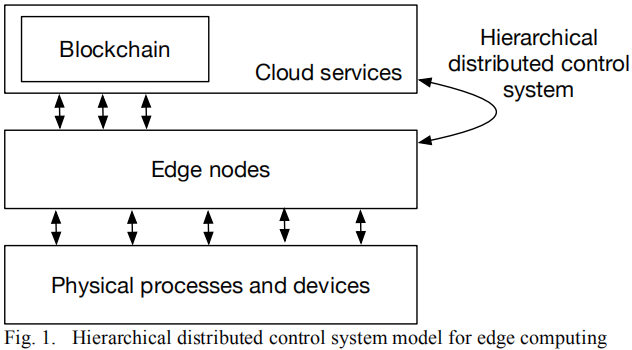

### 区块链与云边端体系结构

&emsp;&emsp;边缘计算可以在网络边缘处理或预处理终端收集或产生的数据，无需将全部数据上传云端，从而减轻云计算中心的网络负载与计算能耗、降低服务延迟与隐私泄漏风险。但在处理复杂统计与分析任务时，边缘计算服务有限的计算和存储能力不能满足任务的需求，需要将边缘计算和云计算结合，互为补充，同时结合终端设备产生的海量数据建构几个层次型的云边端结构来满足复杂任务的需求。在云边端融合架构中，由于边缘服务器或不同的云服务节点等可能分属不同利益方，且在复杂环境下云边端系统易受到攻击，引入区块链技术为解决这些问题提供了新思路。

#### 8.6.2.1 融合区块链的云边端体系架构
&emsp;&emsp;边缘计算与区块链融合能提高物联设备整体效能。以物联网设备群为例，一方面移动边缘计算可以充当物联设备的“局部大脑”，存储和处理同一场景中不同物联设备传回的数据，并优化和修正各种设备的工作状态和路径，从而达到场景整体应用最优。另一方面，物联终端设备可以将数据“寄存”到边缘计算服务器，并在区块链技术的帮助下保证数据的可靠性和安全性，同时也为将来物联设备按服务收费等多种发展方式提供了可能性。

1. Stanciu提出的一个分层分布控制系统，用于在连接到网络的终端设备附近提供计算资源，在物联网、智能电网、医疗保健、智能家居等领域有着广泛的应用。该系统为三层架构，分别是云服务层、边缘层以及物理层。其中，云服务层和边缘层是基于Hyperledger Fabric的区块链解决方案，其中的功能块将作为主管级的智能合约实现。与在执行层执行的负责实际过程控制的边缘节点的集成是基于微服务架构的，Docker容器实现功能块，而Kubernetes平台用于协调容器跨边缘资源的执行。这种类型的架构被用于边缘计算模型，既可以为监测环境的大规模传感器网络提供计算资源，也可以提供基于数据处理和云资源集成的智能服务。具体如图085211-1所示。
