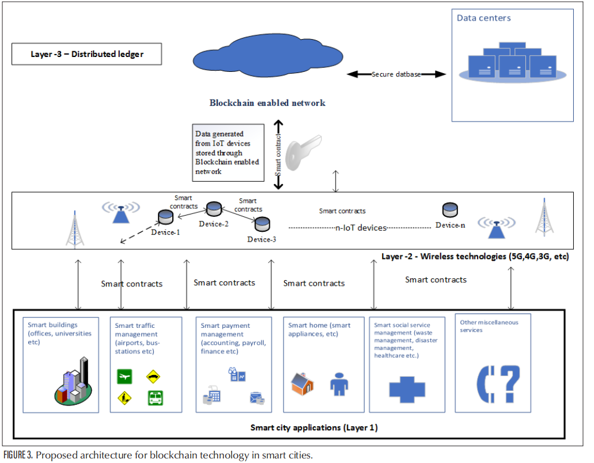
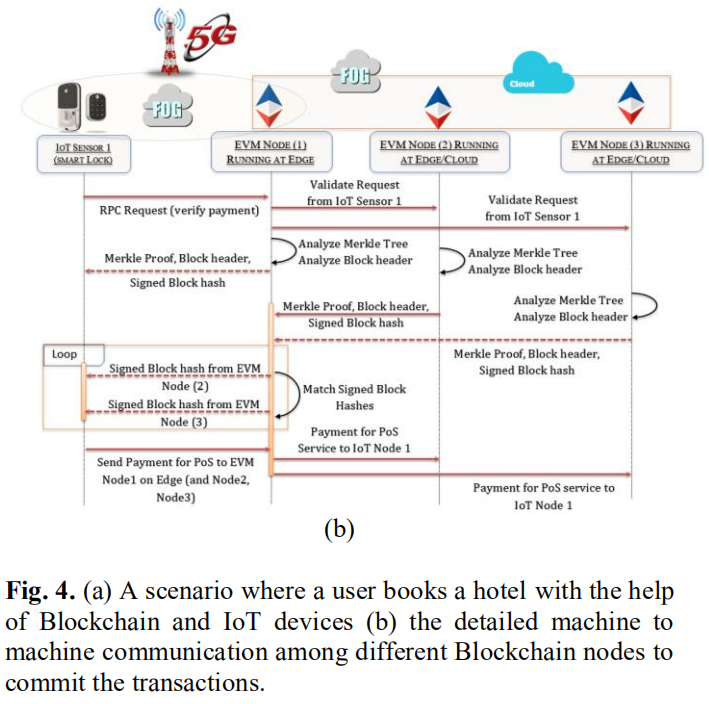

#### 8.6.2.3 智慧城市

&emsp;&emsp;近年来，在智慧城市领域开展了前所未有的工作。发展智慧城市的目的是提高居住在其中的人们的生活质量。为了实现这一目的，人们利用了物联网和云计算等技术。区块链技术也是有前途的技术之一，可以为其最终用户提供无数有价值的服务。作为新兴技术，区块链在智慧城市的诸多领域有较大应用潜力。在基础设施方面，与新型智慧城市相结合，探索在信息基础建设、智慧交通、能源电力等领域实现赋能，提高城市管理智能化，标准化。

1. Saqib Hakak提出一种基于区块链的智慧城市架构，该架构分为三层，第一层包括所有潜在的应用，这其中包含了智慧大厦、智慧交通、智慧支付、智能家居、智慧社会服务等；第二层作为信息载体，由异构互联网和通信技术组成，包含5G、4G等现今通信技术；第三层为基于区块链的存储保护层，用于可信节点达成共识后验证信息块。智慧城市中每个参与节点都包含一份智能合约，该智能合约包含各节点参与信息交换的特定规则，所有交换的信息将被存在第三层。基于区块链的智慧城市架构可以记录每个参与者的访问控制记录，考虑到由于智慧城市有众多设备参与，数据的产生需要征税，区块链则可以提供部分或者完全的数据。其次区块链的激励机制可以激励公民使用不同的智慧城市应用，加速智慧城市建设。目前已有相关应用，如法国城市大脑、智慧迪拜以及柬埔寨首都金边智慧城市项目。

2. Rahman提出了一种基于区块链的基础设施，以面向安全和隐私的时空临时智能合约服务，以实现大型智能城市中可持续物联网（IoT）支持的共享经济。该基础架构利用边缘的认知雾节点来托管和处理来自移动边缘IoT节点的有效负载和交易，并使用AI处理和提取重要事件信息，同时生成语义数字分析，最后将结果保存在区块链和分散的云存储库，以促进智慧城市共享经济服务。该框架提供一种可持续的激励机制，可以潜在地支持安全的智能城市服务，例如共享经济，智能合约以及与区块链和物联网的网络物理交互。以满足智慧城市物联网数据服务，该服务提供网络物理共享经济服务，通过智能合约，该框架可以向提供复杂的金融服务，而不需要中央审核机构。
