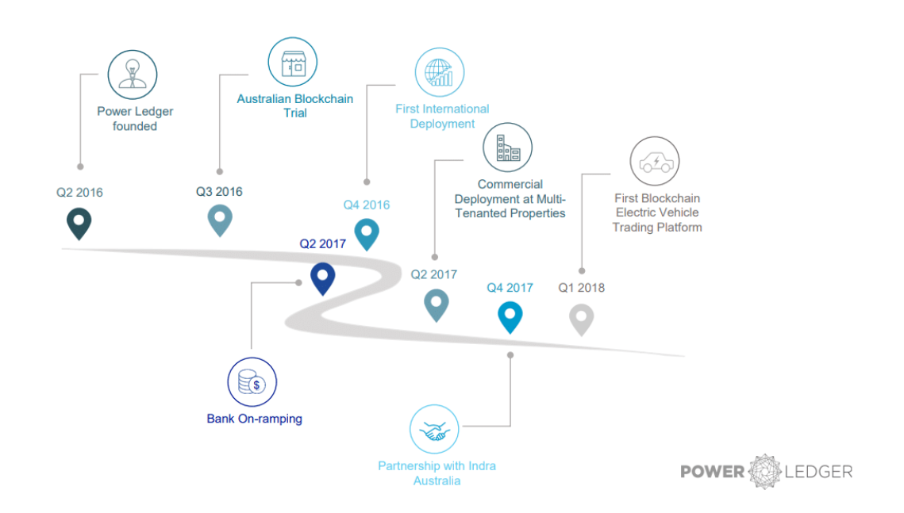
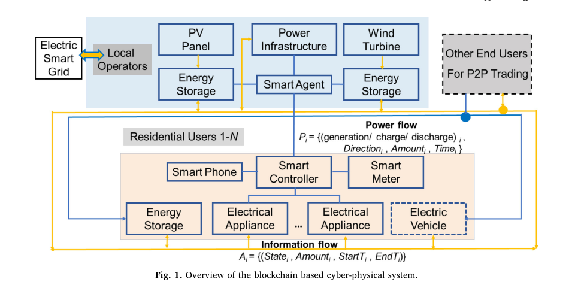
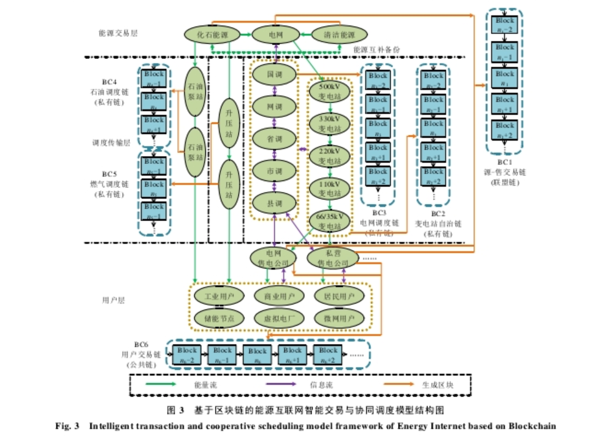

### 8.6.2.4能源互联网
&emsp;&emsp;能源互联网和区块链都具有开放、互联、共享、对等的共同理念。因此，区块链将有望成为解决能源互联网发展瓶颈问题的突破口。目前，国内外已有少数公司开始探索并实践区块链技术在能源互联网中的应用，下面将简要介绍几个区块链技术在能源互联网中应用的实例：
1. Power Ledger由澳大利亚的区块链软件公司Ledger Assets创立。Power Ledger构建了全球首个使用区块链的P2P电力交易系统，这套系统的出现是分布式能源交易的一次伟大尝试，为减少交易成本提供了有效途径。不同于比特币采用的Pow (工作量证明)机制，PowerLedger采用的是POS(权益证明)机制，利用自己的区块链Ecochain，使电能在产生的时候系统就能确定电能的所有者，然后通过一系列交易协议完成电能所有者和消费者之间的交易，住户可以直接将剩余电能卖给其他住户，出售价格高于直接出售给电力公司的价格，电能的生产者获得了更大的收益，电能的消费者也获得了更低的用电成本;

2. 利用区块链自治协同管理和智能交易技术，可研究和解决多能源系统在交易完全去中心化下产能、用能、节能等各互补能源节点的能效自主智能交易。例如，Noor构建了基于区块链的网络物理系统，下图所示。参与者包括住宅用户以及来自商业和工业领域的其他最终用户，他们都与本地运营商相互联系。每个最终用户都有自己的智能控制器，可以与P2P网络中的其他用户交换信息和价值。运营商将P2P电力交易系统作为一个社区来运行，而电网将这个社区作为一个单独的用户使用，但是自治性要远高于该社区中的任何个人。运营商可以通过协商的价格从电网中为那些未满足的需求购买电力，这有助于减少社区对电网的影响，并且通过区块链智能合约交易实现边缘侧设备及存能元件需求侧管理及对等交易[@noor2018energy];

3. 利用区块链去中心的分布式决策与调度机制，可研究和解决在能源系统调度部分去中心化下源–网荷–储各节点主动参与能量流的分布决策、协同调度与潮流分配。龚钢军等从多能源系统的物理拓扑结构和逻辑协议层次分析，考虑能源节点区块链算力不匹配问题，提出了基于区块链技术的能源互联网物理层次架构和逻辑协议层模型,如下图所示。在调度部分去中心化后，提出了基于区块链的垂直分级调度系统和多级变电站的协同调度模式，并定义了该模式下各级调度、电厂、变电站、售电公司与各类用户的节点属性和任务职能，以及处在不同层级、由不同节点所构成的各区块链的类型。形成了以“交易完全去中心化，调度部分去中心化”为特点，基于区块链技术构建的智能交易与协同调度模式，为实现能源互联网高效安全运行贡献了方案及思路[@龚钢军2019基于区块链的能源互联网智能交易与协同调度体系研究];
