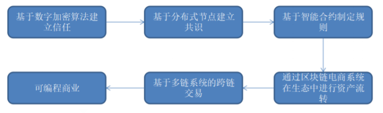
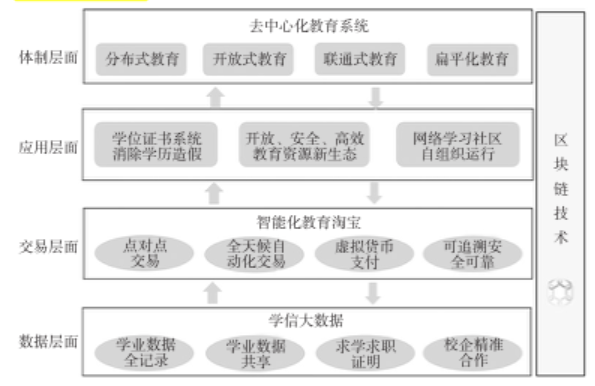

#### 8.6.2.5 共享经济
&emsp;&emsp;共享经济是应用经济学的专业术语，最早由美国德克萨斯州立大学社会学教授马科斯·费尔逊（Marcus Felson）和伊利诺伊大学社会学教授琼·斯潘思（Joel.Spaeth）于1978年提出。共享经济可以定义为以获得一定报酬为主要目的，基于陌生人且存在物品使用权暂时转移的一种新的经济模式。这种经济模式已经渗透到社会和人们生活的方方面面，使人们开始关注共享经济。

&emsp;&emsp;基于对共享经济概念的充分理解，再结合区块链技术的特点——去中心化、点对点网络、时间戳、不可篡改、共识机制、智能合约，可以发现，共享经济和区块链技术有着在本质上共通的属性。因此区块链+共享经济的优势可以归纳为：去中心化降低成本、智能合约促成平台自治、公开透明保证资源合格、时间戳解决纠纷。

&emsp;&emsp;综合来说，在区块链系统中，“区块链+共享经济”的基础主要如下有几点：首先，基于数字加密和分布式节点签名等技术建立系统角色之间的信任和共识；其次，系统中资产的交易使用、违约赔付、到期核算等具有规则属性的业务可以借助于智能合约公平自动进行，用户的不合规行为会受到对应的处理，用户有利于生态建设的行为则会受到奖励。正是在智能合约的这种支撑下，链上用户可以直接交互，根据既定的生态规则，实现平台的自治；另外，在解决信任问题的基础上，依托共享平台的电商系统，加之通证激励的设计，可以有效推动共享资产在多链之间的交易流转，实现共享经济的可编程商业生态，以下举出两个案例进行说明：

1. 目前，民宿、共享乘车（汽车合乘）等提供剩余资源并实现有效利用的共享经济已经得到了人们的关注，我们也期待能够通过使用区块链技术来构筑分布式的共享经济服务。通过平台上代币的激励形成不存在中央服务提供者的网络，并且能自律地持久运行，同时对法律法规有一定的耐受性的共享经济平台也开始出现。共享经济和区块链的结合让P2P租赁共享平台出现是一个典型的例子，例如：Airbnb、HomeAway、GSENetwork、FlipKey16以及OneFineStay等。这类平台有类似特点，如用户将闲置的社会化资源暂时交给别人共享使用、供求双方基数较大、供求一体化、供求主体是个人或小型经济组织等。这类平台的主要作用是将闲散的社会化资源加以整合共享，让供给和需求双方直接对接，实现供应和需求的最优匹配，进而达成资源的高效流动。

2. 区块链技术有望在互联网+教育生态的构建上发挥重要作用，其教育应用价值与思路主要体现在六大方面：建立个体学信大数据、打造智能化教育淘宝平台、开发学位证书系统、构建开放教育资源新生态、实现网络学习社区的“自组织”运行以及开发去中心化的教育系统。图2显示了基于区块链技术构建的互联网+教育新生态体系。区块链技术有助于推动教育体系变革，加速教育系统进化发展。下图为基于区块链技术的互联网+教育新生态图：

* 建立个体学信大数据架起产学合作新桥梁：区块链技术在教育领域可以用做分布式学习记录与存储，允许任何教育机构和学习组织跨系统和
跨平台地记录学习行为和学习结果，并永久保存在云服务器，形成个体学信大数据，有助于解决当前教育领域存在的信用体系缺失和教育就业中学校与企业相脱离等实际问题；
* 打造智能化教育淘宝平台，实现资源与服务的全天候自动交易：通过嵌入智能合约，区块链技术可以完成教育契约和存证，构建虚拟经济教育智能交易系统。该系统中各种服务的购买、使用、支付等工作全部由
系统自动完成，无需人工操作，同时购买记录无法篡改、真实有效，所有的交易和合约数据都将被永久保存；
* 构建安全、高效、可信的开放教育资源新生态：
   * 应用区块链技术加强资源版权保护：基于非对称加密算法保护的版权信息其安全性与可靠性更高，同时鉴于区块链公开透明的特点，任何资源创建信息都可以被使用者查询、追踪、获取，进而有助于从源头上解决版权归属问题；
   * 应用区块链技术降低OER运营成本：将区块链技术的去中心化应用到OER建设中可节省大量中介成本。用户与用户间可直接通过点对点的传播方式进行资源共享，从而减少在大量中介平台上研发与管理维护的投入，改变OER运行机制，有效降低OER运营成本；
   * 应用区块链技术促进资源共享：利用区块链的分布式账本技术，将教育资源分布式存放在不同的区块中，通过点对点的传播方式，所有节点将通过特定的、达成共识的软件协议直接共享学习课件和工具软件等资源，既有助于提高共享效率，又可以解决资源孤岛问题；
   * 实现网络学习社区的真正“自组织”运行，主要体现在：使用虚拟币提高社区成员参与度，形成社区智慧流转体系、保护社区成员智力成果，生成观点进化网络、净化社区生态环境，实现社区成员信誉度认证；
   * 开发去中心化教育系统，全民参与推动教育公平：利用区块链技术开发去中心化教育系统，有助于打破教育权利被学校或政府机构垄断的局面，使教育走向全面开放，形成全民参与、协同建设的一体化教育系统。未来，除了政府机构批准的学校、培训单位等教育机构具有提供教育服务的资质外，将有更多的机构、甚至个体承担专业教育服务提供商的角色，并且基于区块链的开源、透明、不可篡改等特性能保证其教育过程与结果的真实可信[@杨现民2017区块链技术在教育领域的应用模式与现实挑战]。