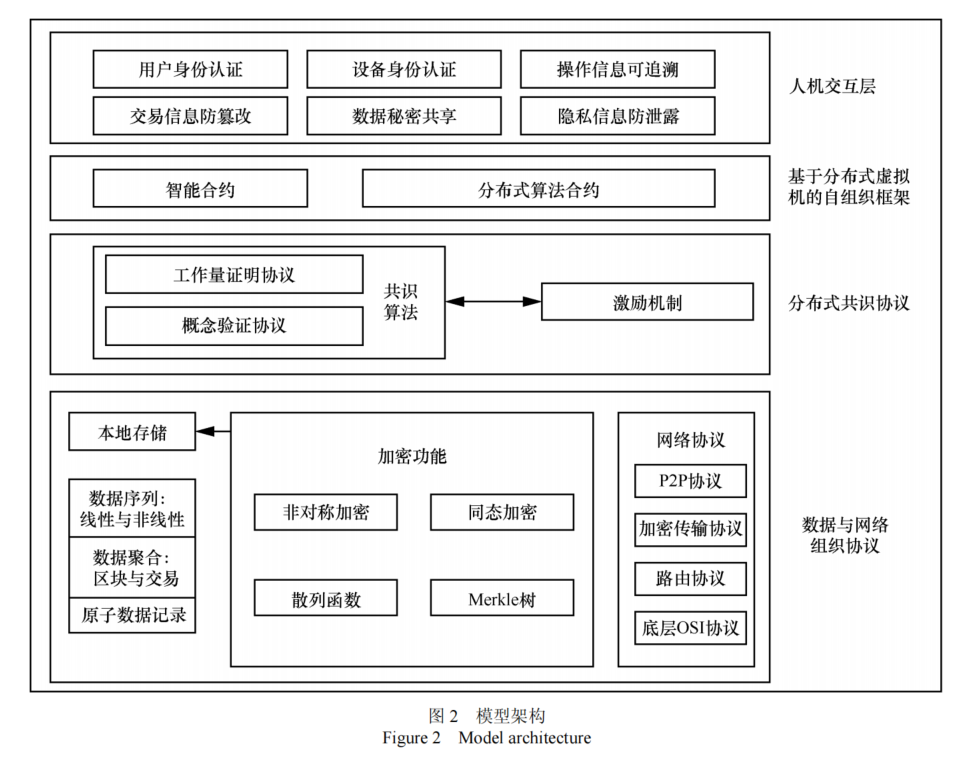
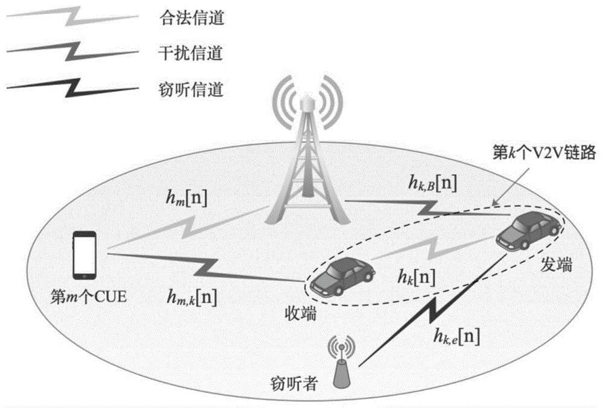

#### 8.2.6.6 车联网
&emsp;&emsp;随着城市智慧化的加速发展，车联网为人类提供了交通管理和出行等方面的便利，成为智慧城市的重要标志，并被写入国家“十三五”规划中[@dennis2016temporal]。越来越多人员和车辆的参与和高度动态的拓扑结构，导致车联网中个人信息可用性和用户隐私保护重要性之间不协调的矛盾，车辆人员信息或车辆位置信息泄露等安全风险对车联网的广泛应用形成了桎梏。

&emsp;&emsp;因此，车联网在提供服务的同时需要重点设计隐私保护模型，使用户既能享有高质量的服务，又能避免自己的隐私信息被第三方非法获取。区块链技术中的去中心化、匿名化特性为解决车联网中相关的问题提供了思路。

&emsp;&emsp;区块链技术是集加解密、数字签名、密钥分存、分布式存储及一致性问题和共识算法于一体的复合技术。区块链将各个数据块进行链接，在每个区块中，都存在区块头和区块体两个结构。区块头包含了版本号、目标散列值、前一个区块地址、时间戳等信息，而区块体中封装了当前所有交易的数据结构。这种数据结构能够从预先选择的节点跟踪每个块的信息并且影响后续节点的信息,其加密方法确保恶意攻击难以篡改信息。根据区块链的可追溯性，车联网用户可以查看所有的交易记录，同时区块链的匿名性保证了人们无法匹配其他人的账户。区块链信息的高度透明、防篡改，可有效降低隐私泄露的风险。王瑞锦等通过设计车联网区块链的块数据结构、网络构建、节点之间协同工作等机制，保证了车联网用户信息的隐私[@王瑞锦2020基于同态加密和区块链技术的车联网隐私保护方案]。区块链在车联网中的应用如下：

1. 车险理赔。在生活中，经常出现的套牌、冒牌问题可以通过区块链技术轻易处理。GPS和北斗能帮助车辆准确地定位到一个经纬度上，联网的车辆也会像比特币系统里面的余额一样，可以进行精确追踪。通过追踪每一辆车的位置信息，利用智能合约规定每一辆车的义务与权力，从而实现避免套牌、冒牌车辆的上路。在车险理赔过程中，一旦发生交通事故，区块中的每一个节点都能够记录事故车辆的详细位置信息和时间戳，从而可以实现快速有效的事故责任认定，提高理赔的效率且保障各方的合法权益[@杨柳青2018区块链技术在车联网中的应用研究]；
2. V2V通信。车辆网络是一类特殊的移动自组网（MANET），目前国内外对车辆网络的研究大多基于车载自组网（VANET）。车载自组织网络（VANET）采用 ad-hoc 的网络形式以便实现车与车（V2V）的直接通信[@mir2017large]。路基设施与车的通信在顶层是靠路侧单元（RSU）与车载单元（OBU）完成。为了实现网络的负载均衡，避免出现因路侧单元负荷过大而造成的单点故障影响整个系统，利用RSU和OBU的通信实现车与车的直接对话机制，V2V也越来越倾向在一定程度上实现去中心化的功能。将车牌作为全网内的唯一标识应用到车联网中，再利用标志密码算法，可以保障车辆之间共享信息的私密性，同时满足在车联网系统中实现快速身份认证。区块链技术还可以通过智能合约来约束通信车辆双方的权利和义务，其去中心化的理念适合小范围内车辆自组织网络中实现内车与车的直接通信[@刘博2018区块链技术在车联网中的应用研究]。