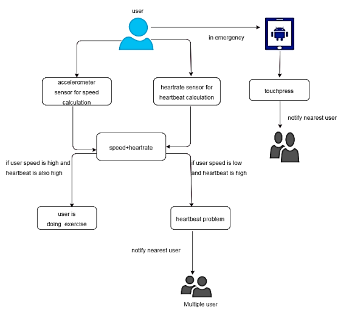
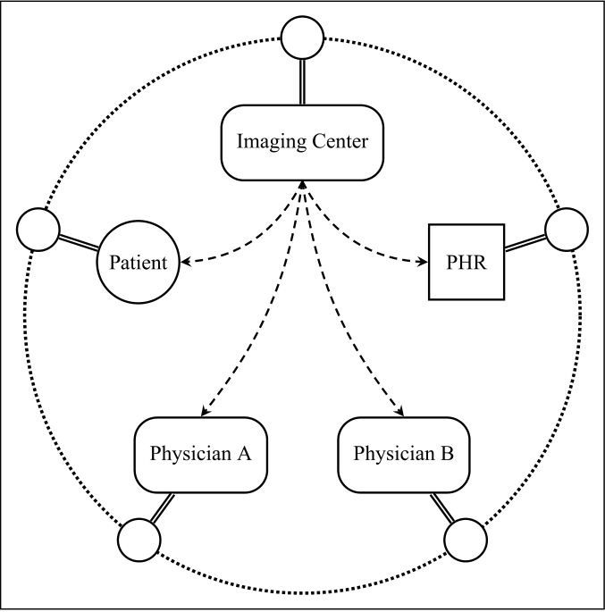

#### 8.6.2.7 智慧医疗
&emsp;&emsp;区块链已发展多年，并应用到了现实生活中的方方面面，比如智能医疗、食品药品安全溯源、类似“绿码”功能的治安防控等，而对于医疗行业的影响可以渗透到多个环节，比如药品药理的科研创新、药品的可信追溯、医疗保险的管理与服务、医保支付改革、基于隐私保护的个人健康管理等。以下举出几个区块链在医疗行业的例子进行阐述：

1. 案例一

&emsp;&emsp;米希尔·特里坎德等人在2019年设计了一套基于移动用户控制区块链的个人健康数据共享与协作系统。该系统实现了数据与数据集样本的匹配。根据用户行为生成用户模式，该模式是一个需要网络节点验证的许可区块链，实现了一个基于隐私保护且从终端设备到云端覆盖范围更广的个人医疗保健系统，并强调用户对健康数据的所有权。该系统还部署了移动应用程序，该应用程序可以从个人可穿戴设备、手动输入和医疗设备收集健康数据，并将数据同步到云，以便与医疗保健提供商和健康保险公司共享数据。为了保证健康数据的完整性，每个记录都可以从云数据库永久的检索出该记录数据完整性和验证的证明，并将其保存在到区块链网络[@dagher2018ancile]。下图为该系统的体系结构图：

2. 案例二

&emsp;&emsp;帕特尔等人在2019年设计了一套基于区块链共识安全和分散共享医学影像数据的系统，该系统通过区块链来存储每一个做过影像检查患者的名字，患者可以被授权访问每一组影像，以及该影像对应的医院。该系统的使用者可以由以下成员组成：进行这项研究的影像中心、医院、门诊、患者以及任何医疗服务提供者、PHR供应商、云服务或是其他委派单位。下图为患者操作影像的流程图：

&emsp;&emsp;每个参与者在图片共享区块链的网络上操作一个节点。患者通过发布区块链事务来访问所选择的实体。影像数据直接从来源转移到这些授权接收方，不需要通过中介机构[@patel2019framework]。

