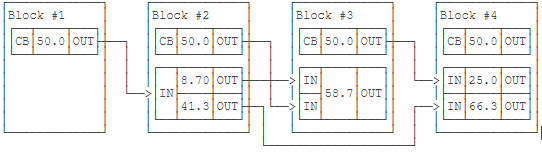

### 数据模型

#### 区块链数据模型（UTXO）

&emsp;&emsp;比特币是链式区块组成，每个区块包含一个或多个交易，其中每个交易是由若干个输入（Input）和若干个输出（Output）构成，除创世区块以外的每个Output指向下一个区块的Input。如图

还未指向下一个Input的Ouput称为UTXO（Unspent Transaction Output），即未花费的交易输出，如图Block #4有一笔50.0的UTXO。每个比特币地址拥有的比特币数量就是由一笔笔UTXO交易组成，UTXO是比特币系统的核心。并且，每个UTXO都是一次性的，即一次必须消耗完，这种一次性的机制避免同一个比特币被多次花费的问题，也叫“双花问题”。

&emsp;&emsp;相比于Account模型的记账方式，UTXO无法直接看到账户余额，需要将每个UTXO里面的比特币累加起来，得出账户总量。

